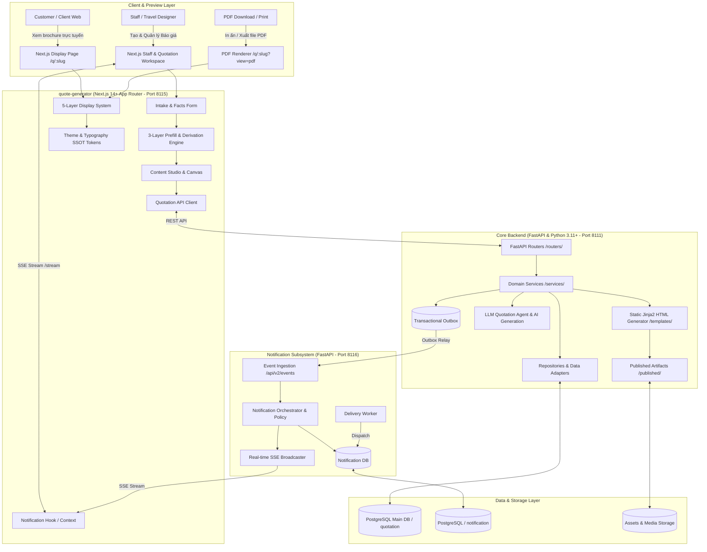

# Travel Quotation & Luxury Brochure Generation Platform

Nền tảng tạo báo giá du lịch tự động, thiết kế brochure đa chế độ (Interactive Web Desktop, Mobile Responsive, PDF Print-Ready) và không gian làm việc (Workspace) chuyên nghiệp cho Travel Designer, Quản lý Tour & Đội ngũ Sales.

---

## 🏛️ Kiến Trúc Hệ Thống Tổng Thể (System Architecture)

Dự án được tổ chức theo mô hình **Monorepo** gồm 3 trụ cột phân tầng rõ ràng: **Core Backend (FastAPI)**, **Frontend App (`quote-generator` / Next.js 14+)**, và **Notification Subsystem (Microservice & Event Stream)**:



---

## 📂 Bản Đồ Thư Mục & Module (Directory Structure)

```text
quotation-landingpage-template/
├── main.py                      # Core FastAPI App Entrypoint (Port 8111)
├── core/                        # Cấu hình core, domain rules, security, settings
├── routers/                     # FastAPI API Endpoints (Quotation, Workspace, Catalog, Media)
├── services/                    # Business Logic, Outbox Service, Quotation Generation
├── repositories/                # Database Access Layer (SQLAlchemy / SQLModel)
├── db/                          # Database connection session & models
├── schemas/                     # Pydantic Request/Response validation schemas
├── alembic/                     # Database migrations cho Core Backend
├── templates/                   # Jinja2 HTML brochure templates & prototypes
├── published/                   # Các file brochure HTML đã xuất bản
├── assets/                      # Static assets (images, logos, destination icons)
├── tests/                       # Python Backend Pytest Suite
│
├── notification/                # 🔔 Notification Subsystem & Event Stream (Port 8116)
│   ├── api/                     # Ingestion API, Notification REST, SSE Stream
│   ├── core/                    # Notification Orchestrator, Policy, Preferences
│   ├── infrastructure/          # Asyncpg DB Engine & In-Memory SSE Broadcaster
│   ├── workers/                 # Background Delivery Worker
│   ├── alembic/                 # Migrations riêng cho Notification DB
│   ├── main.py                  # Notification FastAPI Entrypoint
│   ├── AGENTS.md                # 🌟 Master Rules cho Notification Module
│   └── README.md                # Tài liệu kỹ thuật chi tiết Notification
│
├── quote-generator/             # Frontend Next.js 14+ App Router (Port 8115)
│   ├── app/                     # Next.js App Router (RSC Pages, API Routes, Layouts)
│   │   ├── [locale]/q/[slug]/   # Public Interactive Brochure Page (RSC)
│   │   ├── workspace/           # Staff Workspace & Quotation Intake Forms
│   │   └── content-studio/      # Visual Content & Typography Editor
│   ├── components/              # React UI Components (Display, Workspace, Selectors)
│   ├── config/                  # Typography SSOT (typography.ts) & Theme Tokens
│   ├── display/                 # 5-Layer Display System (Builder, Registry, Contracts)
│   ├── lib/                     # Prefill Engine, Pure Rules & API Clients
│   └── docs/                    # Tài liệu hợp đồng kỹ thuật Frontend
│
├── .agents/                     # AI Skills & Coding Governors (Cursor/Antigravity/Codex)
│   └── skills/                  # Các bộ quy chuẩn mã nguồn tự động
├── AGENTS.md                    # 🌟 Master Rules & Central Router cho AI Agents
├── CLAUDE.md                    # Chỉ dẫn tích hợp cho Claude Code CLI
└── README.md                    # Tài liệu hướng dẫn tổng quan dự án (File này)
```

---

## 🔔 Module Thông Báo & Outbox Event Stream

Dự án sở hữu hệ thống thông báo đa kênh, hoạt động theo mô hình **Transactional Outbox Pattern**:
1. Khi có sự kiện kinh doanh phát sinh (tạo request mới, tạo báo giá, hoàn tất phát hành), Core Backend ghi nhận sự kiện vào bảng `outbox_events` trong cùng một transaction.
2. `services/outbox_relay.py` tiếp vận sự kiện sang **Notification Service (`notification/`, port 8116)**.
3. Notification Service đánh giá người nhận, lưu trữ thông báo vào database riêng và phát sóng tức thì qua kênh **Server-Sent Events (SSE)** tới giao diện Workspace của nhân viên.
4. Xem chi tiết kiến trúc và cách đăng ký sự kiện mới tại **[`notification/README.md`](./notification/README.md)**.

---

## ⚡ Hướng Dẫn Cài Đặt & Khởi Chạy (Getting Started)

### 1. Yêu Cầu Môi Trường
- **Python**: $\ge$ 3.10 (khuyến nghị Python 3.11)
- **Node.js**: $\ge$ 18.18 (khuyến nghị Node 20 LTS)
- **PostgreSQL**: $\ge$ 15
- **npm** hoặc **pnpm**

---

### 2. Cài Đặt & Chạy Core Backend (Port 8111)

```bash
# 1. Tạo và kích hoạt môi trường ảo
python3 -m venv .venv
source .venv/bin/activate  # Trên Windows: .venv\Scripts\activate

# 2. Cài đặt dependencies
pip install -r requirements.txt

# 3. Thiết lập biến môi trường
cp .env.example .env

# 4. Chạy migration database Core
alembic upgrade head

# 5. Khởi chạy Core Backend Server (port 8111)
uvicorn main:app --reload --port 8111
```
> API Docs Swagger sẵn sàng tại: [http://localhost:8111/docs](http://localhost:8111/docs)

---

### 3. Cài Đặt & Chạy Notification Subsystem (Port 8116)

```bash
# 1. Chạy migration database Notification
alembic -c notification/alembic.ini upgrade head

# 2. Khởi chạy Notification API Service (port 8116)
uvicorn notification.main:app --reload --port 8116

# 3. Khởi chạy Delivery Worker (terminal riêng)
python -m notification.workers.delivery_worker
```
> Health check: [http://localhost:8116/health](http://localhost:8116/health)

---

### 4. Cài Đặt & Chạy Frontend (`quote-generator` - Port 8115)

```bash
# 1. Di chuyển vào thư mục frontend
cd quote-generator

# 2. Cài đặt dependencies
npm install

# 3. Khởi chạy Frontend Dev Server (port 8115)
npm run dev
```
> Ứng dụng Next.js sẽ chạy tại: [http://localhost:8115](http://localhost:8115)
> - Xem brochure mẫu: `http://localhost:8115/?view=desktop`
> - Vào Workspace nhân viên: `http://localhost:8115/workspace/requests/new`

---

### 5. Chạy Toàn Bộ Stack Bằng Docker Compose

```bash
# Khởi chạy toàn bộ hệ thống ở môi trường local
docker compose -f docker-compose.local.yml up -d
```

---

## 🧪 Kiểm Thử & Kiểm Soát Chất Lượng (Quality Gates)

### Backend Pytest Suite
```bash
# Chạy toàn bộ test suites backend và domain rules
PYTHONPATH=. pytest tests/test_domain_rules.py tests/test_business_gates.py tests/test_quote_request_service.py

# Chạy test suite Notification
PYTHONPATH=. pytest tests/test_notification_api.py
```

### Frontend Linters & Build Gates
```bash
cd quote-generator
npm run lint               # TypeScript & ESLint
npm run lint:typography    # Typography SSOT validation
npm run lint:display-system# Display system boundary validation
npm run build              # Production build check
```

---

## 🤖 Chỉ Dẫn Dành Cho AI Coding Assistants

Hệ thống được chuẩn hoá theo triết lý **Vibe Coding & Multi-Tier SSOT**:
- **Router trung tâm**: **[`AGENTS.md`](./AGENTS.md)** (Định vị 3 trụ cột và ranh giới hệ thống).
- **Notification Subsystem**: **[`notification/AGENTS.md`](./notification/AGENTS.md)** (5 Hợp đồng bất biến cho sự kiện & thông báo).
- **Frontend chi tiết**: **[`quote-generator/README.md`](./quote-generator/README.md)**.
- **Claude Code CLI**: **[`CLAUDE.md`](./CLAUDE.md)**.
