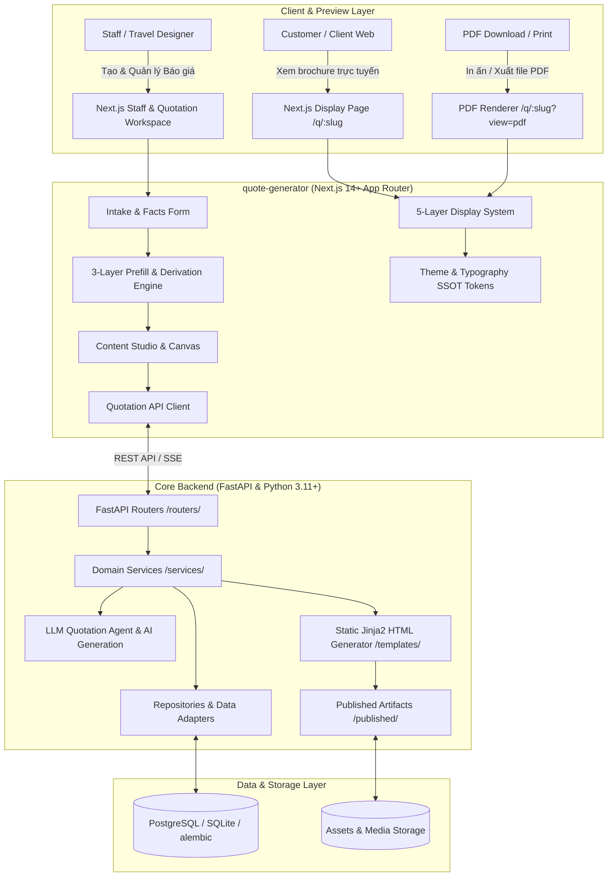

# Travel Quotation & Luxury Brochure Generation Platform

Nền tảng tạo báo giá du lịch tự động, thiết kế brochure đa chế độ (Interactive Web Desktop, Mobile Responsive, PDF Print-Ready) và không gian làm việc (Workspace) chuyên nghiệp cho Travel Designer, Quản lý Tour & Đội ngũ Sales.

---

## 🏛️ Kiến Trúc Hệ Thống Tổng Thể (System Architecture)

Dự án được tổ chức theo mô hình **Monorepo** phân tầng rõ ràng giữa **FastAPI Backend**, **Next.js 14+ App Router Frontend (`quote-generator`)**, và **Static HTML/PDF Publishing Engine**:



---

## 📂 Bản Đồ Thư Mục & Module (Directory Structure)

```text
quotation-landingpage-template/
├── main.py                      # FastAPI App Entrypoint & Route Mounting
├── core/                        # Cấu hình core, security, settings, logging
├── routers/                     # FastAPI API Endpoints (Quotation, Workspace, Catalog, Media)
├── services/                    # Business Logic, Quotation Generation, PDF & HTML Renderers
├── repositories/                # Database Access Layer (SQLAlchemy / SQLModel)
├── db/                          # Database connection session & models
├── schemas/                     # Pydantic Request/Response validation schemas
├── alembic/                     # Database migrations
├── templates/                   # Jinja2 HTML brochure templates & prototypes
├── published/                   # Các file brochure HTML đã xuất bản
├── assets/                      # Static assets (images, logos, destination icons)
├── tests/                       # Python Backend Pytest Suite
│
├── quote-generator/             # Frontend Next.js 14+ App Router
│   ├── app/                     # Next.js App Router (RSC Pages, API Routes, Layouts)
│   │   ├── [locale]/q/[slug]/   # Public Interactive Brochure Page (RSC)
│   │   ├── workspace/           # Staff Workspace & Quotation Intake Forms
│   │   └── content-studio/      # Visual Content & Typography Editor
│   ├── components/              # React UI Components
│   │   ├── display/             # Atoms, Molecules, Sections, Route Map & Carousel
│   │   ├── quotation-workspace/ # Quotation Intake, Facts Form, Commercial Panels
│   │   ├── staff-workspace/     # Tour Components Catalog, Request Details, Data Views
│   │   ├── destination/         # DestinationSelect & useDestinationSearch Hook
│   │   ├── accommodation/       # AccommodationSelect & useAccommodationSearch Hook
│   │   ├── partner/             # PartnerSelect & usePartnerSearch Hook
│   │   ├── travel-designer/     # TravelDesignerSelect & useTravelDesignerSearch Hook
│   │   └── ui/                  # Reusable UI Controls (CustomSelect, RichTextEditor)
│   ├── config/                  # Typography SSOT (typography.ts) & Theme Tokens
│   ├── display/                 # 5-Layer Display System (Builder, Registry, Contracts)
│   ├── data/                    # Facts Schema & Static Reference Data
│   ├── lib/                     # Prefill Engine, Pure Rules & API Clients
│   └── docs/                    # Tài liệu hợp đồng kỹ thuật Frontend
│
├── .agents/                     # AI Skills & Coding Governors (Cursor/Antigravity/Codex)
│   └── skills/                  # Các bộ quy chuẩn mã nguồn tự động
├── AGENTS.md                    # 🌟 Master Rules & Vibe Coding Guidelines cho AI Agents
├── CLAUDE.md                    # Chỉ dẫn tích hợp cho Claude Code CLI
└── README.md                    # Tài liệu hướng dẫn tổng quan dự án (File này)
```

---

## 🔄 Luồng Dữ Liệu End-to-End (Data Flow)

1. **Intake & Nhập liệu Yêu cầu**:
   - Nhân viên sales hoặc khách hàng điền thông tin qua `MinimalQuotationIntakeForm` hoặc API endpoint `/api/v1/quotations/requests`.
2. **Kích hoạt 3-Layer Prefill Engine**:
   - Dữ liệu thô được đưa qua pure rules tại `quote-generator/lib/prefillRules.ts` để tính số ngày/đêm, phân bổ bữa ăn (EN/VI/AR), gợi ý điểm lưu trú qua đêm và định danh traveller.
   - Các Facade Updaters tại `quote-generator/lib/prefillEngine.ts` cập nhật state đơn lượt (single-pass), loại bỏ render lặp.
3. **Lưu trữ & Chuẩn hóa QuoteDocument**:
   - Backend FastAPI tiếp nhận payload, validate qua Pydantic schema `QuoteDocument` (`quote_document.py`), lưu vào CSDL và sinh mã truy cập duy nhất (`slug`).
4. **Hiển thị Brochure Đa Chế độ (5-Layer Display System)**:
   - Route `quote-generator/app/[locale]/q/[slug]/page.tsx` nạp dữ liệu ở Server Component (RSC), map sang `PageViewModel`.
   - Brochure render tĩnh tức thì, hỗ trợ 3 chế độ:
     - `/?view=desktop`: Giao diện Web Desktop cao cấp với bản đồ tương tác (`RouteMapClientIsland`) và Carousel.
     - `/?view=mobile`: Tối ưu chạm lướt, layout dọc chuẩn responsive.
     - `/?view=pdf` hoặc `/pdf`: Định dạng chuẩn in ấn (A4 page breaks, static map, vector typography).

---

## ⚡ Hướng Dẫn Cài Đặt & Khởi Chạy (Getting Started)

### 1. Yêu Cầu Môi Trường
- **Python**: $\ge$ 3.11
- **Node.js**: $\ge$ 18.18 (khuyến nghị Node 20 LTS)
- **npm** hoặc **pnpm**

---

### 2. Cài Đặt & Chạy Backend (FastAPI)

```bash
# 1. Tạo và kích hoạt môi trường ảo
python3 -m venv .venv
source .venv/bin/activate  # Trên Windows: .venv\Scripts\activate

# 2. Cài đặt dependencies
pip install -r requirements.txt

# 3. Thiết lập biến môi trường
cp .env.example .env

# 4. Chạy migration database (nếu cần)
alembic upgrade head

# 5. Khởi chạy Backend Server (port 8111)
uvicorn main:app --reload --port 8111
```
> API Docs Swagger sẽ sẵn sàng tại: [http://localhost:8111/docs](http://localhost:8111/docs)

---

### 3. Cài Đặt & Chạy Frontend (`quote-generator`)

```bash
# 1. Di chuyển vào thư mục frontend
cd quote-generator

# 2. Cài đặt dependencies
npm install

# 3. Khởi chạy Frontend Dev Server (port 8115)
npm run dev
```
> Ứng dụng Next.js sẽ chạy tại: [http://localhost:8115](http://localhost:8115)
> - Xem brochure mẫu: `http://localhost:8115/?view=desktop`
> - Xem chế độ Mobile: `http://localhost:8115/?view=mobile`
> - Xem chế độ PDF: `http://localhost:8115/?view=pdf`
> - Vào Workspace nhân viên: `http://localhost:8115/workspace/quotations/new`

---

### 4. Chạy Bằng Docker Compose (Tùy chọn)

```bash
# Khởi chạy toàn bộ hệ thống ở môi trường local
docker-compose -f docker-compose.local.yml up --build
```

---

## 🧪 Kiểm Thử & Kiểm Soát Chất Lượng (Quality Gates)

### Backend Tests
```bash
# Chạy toàn bộ test suite backend
python -m pytest tests
```

### Frontend Linters & Build Gates
Trước khi tạo Pull Request hoặc commit code mới, frontend bắt buộc phải vượt qua 4 chốt kiểm duyệt:
```bash
cd quote-generator

# 1. Chạy TypeScript & ESLint
npm run lint

# 2. Kiểm tra tuân thủ Typography SSOT (không cho phép hardcode text class bừa bãi)
npm run lint:typography

# 3. Kiểm tra ranh giới hiển thị Display System
npm run lint:display-system

# 4. Build kiểm tra Server Component & Type Safety
npm run build
```

---

## 🤖 Chỉ Dẫn Dành Cho Lập Trình Viên & AI Coding Assistants

Để đảm bảo chất lượng code và tránh làm hỏng các hợp đồng kiến trúc (SSOT) khi vibe coding cùng AI:
- Đọc kỹ tài liệu **[AGENTS.md](./AGENTS.md)** (Quy tắc bất biến cho AI Agents).
- Frontend chi tiết: xem **[quote-generator/README.md](./quote-generator/README.md)**.
- Các hợp đồng dữ liệu:
  - [Display System Contract](./quote-generator/docs/display-system-contract.md)
  - [Typography Contract](./quote-generator/docs/typography-contract.md)
  - [Prefill System Contract](./quote-generator/docs/prefill-system-contract.md)
