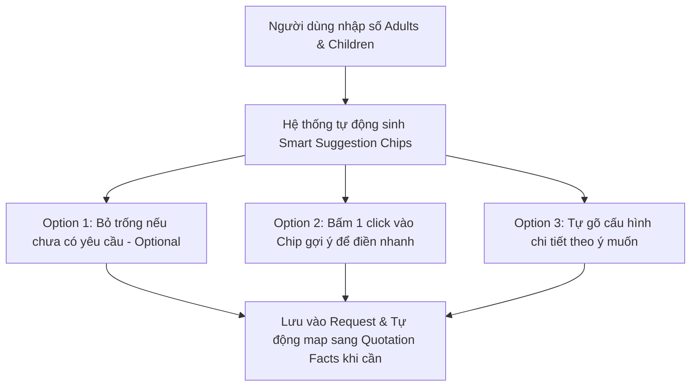

# Kế Hoạch Bổ Sung & Tích Hợp Toàn Diện Các Trường Dữ Liệu Từ Selvara Trip Brief Vào `requests/new` (Đã Tinh Chỉnh Theo Phản Hồi)

## 1. Tổng Quan & Cập Nhật Theo Phản Hồi (Refined Requirements)

Dựa trên phản hồi và phân tích nghiệp vụ thực tế của quy trình thiết kế tour cao cấp (Luxury Tailor-made Travel):
1. **`sales_owner` -> `travel_designer_id`**: `sales_owner` chính là **Travel Designer**, liên kết trực tiếp với thực thể `travel_designer_profiles` thông qua component `TravelDesignerPicker` và lưu vào `created_by_profile_id` / `travel_designer_id`.
2. **Loại bỏ các trường dư thừa (`repeat_client`, `nights`, `guests`)**:
   - ❌ Bỏ `repeat_client` (thông tin bối cảnh lịch sử khách sẽ được ghi tự nhiên trong `client_context`).
   - ❌ Bỏ `nights` nhập tay (hệ thống tự động tính `duration_nights` từ ngày đi/về hoặc lịch trình).
   - ❌ Bỏ `guests` nhập tay (tổng số khách đã được xác định chính xác qua `adults` + `children` + `kid_ages`).
3. **Giải Pháp Thiết Kế Cho Trường Cấu Hình Phòng (`rooms`)**:
   - Xem chi tiết tại [Mục 3: Brainstorm Giải Pháp Thiết Kế Trường `rooms`](#3-brainstorm-chuyên-sâu-giải-pháp-cho-trường-cấu-hình-phòng-rooms).

---

## 2. Bảng So Sánh Ngữ Nghĩa Cập Nhật (Updated Semantic Matrix)

| Nhóm Intake (HTML Section) | Trường Intake (HTML Field) | Trạng Thái Trong `requests/new` | Xử Lý & Ánh Xạ Trong Thiết Kế Mới |
| :--- | :--- | :---: | :--- |
| **1. Internal / Lead Info** | `brand` | ❌ **Bổ sung** | Thêm Dropdown chọn Brand (*Selvara Journeys, Capella Travel, Vietnam Safar*) |
| | `client_type` | ✅ **Đã có** | Map tương đương với `role` (`traveller` = B2C, `advisor` = B2B) |
| | `sales_owner` | 🔄 **Tinh chỉnh** | Sử dụng **`TravelDesignerPicker`** liên kết `travel_designer_profiles` |
| | `priority` | ❌ **Bổ sung** | Thêm Dropdown mức độ ưu tiên (*Normal, Warm, Hot*) |
| | `lead_source` | ❌ **Bổ sung** | Thêm Dropdown nguồn Lead (*Website, Email, WhatsApp, Referral, Advisor, Trade Show...*) |
| | `quotation_id` | ⚡ **Tự sinh** | Hệ thống tự động sinh ID khi tạo báo giá |
| | `quote_deadline` | ❌ **Bổ sung** | Thêm Date Picker hạn chót trả báo giá |
| | `decision_date` | ❌ **Bổ sung** | Thêm Date Picker ngày dự kiến khách chốt |
| **2. Client / Partner Profile** | `traveller_name` | ✅ **Đã có** | Ghép từ `first_name` + `last_name` thành `customer_name` |
| | `market` | ✅ **Đã có** | Lưu vào `market` / `country` |
| | `email`, `phone` | ✅ **Đã có** | Đã lưu vào các trường tương ứng |
| | `agency`, `advisor`, `partner_contact` | ✅ **Đã có** | Đã hỗ trợ cho Persona `advisor` |
| | `repeat_client` | 🗑️ **BỎ** | **Không sử dụng** theo phản hồi người dùng |
| | `client_context` | ❌ **Bổ sung** | Thêm Textarea ghi chú bối cảnh & lịch sử khách |
| **3. Travel Basics** | `arrival_date`, `departure_date` | ✅ **Đã có** | `start_date`, `end_date` và `raw_dates_text` |
| | `date_flexibility` | 🟡 **Hoàn thiện** | Chuẩn hóa `travel_timing` (*Fixed, ±1 day, ±2–3 days, Flexible month*) |
| | `nights` | 🗑️ **BỎ NHẬP TAY** | Tự động tính toán từ ngày bay hoặc số ngày lịch trình |
| | `guests` | 🗑️ **BỎ NHẬP TAY** | Tự động tính từ `adults + children` |
| | `adults`, `children`, `kid_ages` | ✅ **Đã có** | Counter & Dynamic Kid Ages array |
| | `infants` | ❌ **Bổ sung** | Ô nhập số lượng em bé & độ tuổi (tùy chọn) |
| | **`rooms`** | 💡 **Thiết kế mới** | **Input Tự do + Gợi ý thông minh (Smart Suggestion Chips) - Không bắt buộc** |
| | `arrival_city`, `departure_city` | ❌ **Bổ sung** | Thêm ô nhập điểm đến/đi (Arrival/Departure City) |
| | `countries`, `destinations` | 🟡 **Hoàn thiện** | Hỗ trợ nhập lộ trình mong muốn tổng quan |
| | `routing_constraints` | ❌ **Bổ sung** | Thêm Textarea ghi nhận chuyến bay đã đặt, ngày cố định |
| **4. Travel Style & Vision** | `travel_style` | ✅ **Đã có** | Map từ `primary_theme` / `advisor_journey_type` |
| | `travel_pace` | ❌ **Bổ sung** | Dropdown (*Relaxed, Balanced, Active*) |
| | `priority_1, 2, 3` | ❌ **Bổ sung** | 3 ô nhập ưu tiên hàng đầu của khách |
| | `occasion` | ❌ **Bổ sung** | Ô nhập dịp đặc biệt (*Honeymoon, Anniversary, Birthday...*) |
| | `must_have`, `avoid` | ❌ **Bổ sung** | Textarea trải nghiệm bắt buộc & điều cần tránh |
| | `interests`, `privacy`, `experience_expectations`| ❌ **Bổ sung** | Textarea & Dropdown chuyên sâu về gu trải nghiệm |
| **5. Accommodation Reqs** | `hotel_level`, `preferred_hotel`, `room_type`, `bedding`, `connecting`, `suite_interest`, `hotel_style` | ❌ **Bổ sung** | Gộp vào **Accordion: Accommodation Requirements** |
| **6. Service Scope for Costing** | Xe riêng, HDV, Vé bay nội địa/quốc tế, Tàu/Thuyền, Gói ăn, Chuẩn ẩm thực, Visa, Đón tiễn, Bảo hiểm | ❌ **Bổ sung** | Gộp vào **Accordion: Service Scope for Costing** |
| **7. Special Requirements** | `dietary`, `halal`, `mobility`, `health_considerations` | ❌ **Bổ sung** | Gộp vào **Accordion: Special & Health Requirements** |
| **8. Commercial Parameters** | `budget`, `budget_basis`, `currency`, `pricing_type`, `commission` (B2B), `target_gp`, `contingency`, `payment_terms` | ❌ **Bổ sung** | Gộp vào **Accordion: Commercial & B2B Parameters** |
| **9. Output & Strategy** | `price_display`, `quote_options`, `rfq_required`, `rate_risk`, `preferred_suppliers`, `missing_info`, `selling_angle`, `internal_notes` | ❌ **Bổ sung** | Gộp vào **Accordion: Costing Readiness & Sales Strategy** |

---

## 3. Brainstorm Chuyên Sâu: Giải Pháp Cho Trường Cấu Hình Phòng (`rooms`)

### 3.1 Bối Cảnh Nghiệp Vụ & Bài Toán Cần Giải
Trong thực tế tiếp nhận yêu cầu du lịch (Request Intake):
- **Trường hợp 1 (Chưa có thông tin / Chưa nghĩ ra)**: Khách mới chỉ hỏi chung chung hoặc Travel Designer chưa liên hệ để tư vấn chi tiết phòng ốc. **Không được bắt buộc nhập `rooms`**.
- **Trường hợp 2 (Cấu hình chuẩn theo số lượng pax)**: 2 người lớn thường đi 1 phòng Double (King) hoặc Twin; gia đình 2 lớn + 2 nhỏ thường cần 2 phòng connecting hoặc Family Suite.
- **Trường hợp 3 (Yêu cầu đặc thù / Phức tạp)**: Khách có yêu cầu riêng như *"1 phòng King tầng cao + 1 phòng Twin gần nhau (non-smoking)"*, *"3-bedroom pool villa"*, *"1 phòng Single cho HDV/người đi cùng"*.

### 3.2 Giải Pháp Giao Diện & Trải Nghiệm Người Dùng (UX Flow)



1. **Trạng thái Mặc định (Optional & Non-blocking)**:
   - Nhãn: `Room Configuration (Optional)`
   - Placeholder: `e.g. 1 Double (King) + 1 Twin (connecting). Leave blank if not decided yet.`
2. **Gợi Ý Nhanh Bằng 1-Click (Smart Preset Chips)**:
   Dựa trên giá trị `adults` và `children`, giao diện tự động render các thẻ chip bấm nhanh bên dưới ô input:
   - **Khi 1 Adult, 0 Child**: `[1 Single Room]` `[1 Double for Single Use]`
   - **Khi 2 Adults, 0 Child**: `[1 Double (King)]` `[1 Twin (2 Beds)]`
   - **Khi 2 Adults, 1-2 Children**: `[1 Double + 1 Twin (Connecting)]` `[1 Family Suite / Villa]` `[1 Double + Extra Bed]`
   - **Khi >= 3 Adults**: `[2 Double Rooms]` `[1 Double + 1 Twin]` `[3 Separate Rooms]` `[Multi-bedroom Villa]`
3. **Linh hoạt Tùy chỉnh (Free-text Editing)**:
   - Khi bấm vào chip, text sẽ tự điền vào input. Người dùng có thể chỉnh sửa thêm (ví dụ: thêm *"tầng cao, view biển"*).
4. **Đồng bộ Dữ liệu Hạ nguồn (Downstream Derivation)**:
   - Khi Travel Designer bấm **+ Generate Quotation**, nếu trường `rooms` có dữ liệu, hệ thống tự động đưa vào `service_facts.room_notes` và làm gợi ý cho phần khách sạn trong Quotation Facts. Nếu rỗng, báo giá vẫn được sinh bình thường.

---

## 4. Kiến Trúc Phân Bổ Form (3-Tiered Form Layout)

```
┌────────────────────────────────────────────────────────────────────────┐
│ TẦNG 1: THÔNG TIN CỐT LÕI (Core Form Header & Essentials)              │
│ 1. Brand Selector (Selvara, Capella, Vietnam Safar)                    │
│ 2. Travel Designer Picker (Liên kết profile sales owner)               │
│ 3. Lead Priority (Normal/Warm/Hot) & Quote Deadline                    │
│ 4. Persona Selection (Traveller / Travel Advisor)                      │
│ 5. Contacts (Tên, Email, SĐT, Market, Company nếu là B2B)              │
│ 6. Dates & Pax (Start/End Date, Adults, Children, Kid Ages Array)      │
│ 7. Room Config (Optional + Smart Preset Chips)                         │
│ 8. Arrival/Departure City & Primary Travel Style                       │
└──────────────────────────────────┬─────────────────────────────────────┘
                                   │ Các Accordion Tùy chọn (Mặc định thu gọn)
                                   ▼
┌────────────────────────────────────────────────────────────────────────┐
│ TẦNG 2: CÁC ACCORDION CHỨC NĂNG CHUYÊN SÂU                             │
│ 📁 Accordion A: Accommodation & Hotel Preferences                      │
│    - Hạng sao (4-5* / Luxury / Boutique), Gu khách sạn, Bedding, Suite │
│ 📁 Accordion B: Service Scope for Costing                              │
│    - Xe riêng, HDV, Vé bay nội địa/quốc tế, Tàu thuyền, Gói ăn uống... │
│ 📁 Accordion C: Special, Dietary & Accessibility Reqs                  │
│    - Ăn kiêng, Halal, Khả năng vận động, Ghi chú sức khỏe quan trọng  │
│ 📁 Accordion D: Commercial, Pricing & B2B Parameters                   │
│    - Budget & Tiền tệ, Pricing Type, Commission % (B2B), Payment Terms │
│ 📁 Accordion E: Costing Readiness & Sales Strategy                     │
│    - RFQ status, Rủi ro mùa cao điểm, NCC ưu tiên, Góc bán hàng (USP)  │
│ 📁 Accordion F: Basic Daily Itinerary Grid (Optional)                  │
│    - Lịch trình phác thảo từng ngày (Day #, Date, Dest, Summary)       │
└──────────────────────────────────┬─────────────────────────────────────┘
                                   │
                                   ▼
┌────────────────────────────────────────────────────────────────────────┐
│ TẦNG 3: PERSISTENCE & QUOTATION FACTS DERIVATION                       │
│ - Lưu trữ trọn vẹn vào database (cột chính + `payload_json`)           │
│ - Khi click "+ Generate Quotation": Tự động suy luận và sinh Facts    │
│   cho Pricing, Services, Stays, Traveller & Designer Profile          │
└────────────────────────────────────────────────────────────────────────┘
```

---

## 5. Kế Hoạch Triển Khai Chi Tiết (Sprints & Atomic Tasks)

### Sprint 1: Backend Data Contracts & Derivation Engine
- [ ] **Task 1.1**: Mở rộng Schema Pydantic trong `schemas/v2/quote_request.py`.
- [ ] **Task 1.2**: Cập nhật DB Model & Repository trong `db/models/quote_request.py` và `repositories/quote_request_repository.py`.
- [ ] **Task 1.3**: Nâng cấp Facts Derivation Converter trong `services/quote_request_service.py`.
- [ ] **Task 1.4**: Bổ sung Unit Tests Backend trong `tests/test_v2_quote_requests.py`.

### Sprint 2: Frontend Smart Components & Modular Sub-forms
- [ ] **Task 2.1**: Mở rộng TypeScript contracts trong `quote-generator/components/quotation-workspace/factsTypes.ts`.
- [ ] **Task 2.2**: Xây dựng `RoomConfigInput.tsx` với Smart Preset Suggestion Chips.
- [ ] **Task 2.3**: Xây dựng `ServiceScopeAccordion.tsx`.
- [ ] **Task 2.4**: Xây dựng `CommercialParametersAccordion.tsx`.
- [ ] **Task 2.5**: Xây dựng `ReadinessAndStrategyAccordion.tsx`.

### Sprint 3: Tích Hợp Vào `requests/new` & `DetailRequestView`
- [ ] **Task 3.1**: Tích hợp `TravelDesignerPicker` và `RoomConfigInput` vào `QuoteRequestForm.tsx`.
- [ ] **Task 3.2**: Cập nhật form state & API submit payload trong `requests/new/page.tsx`.
- [ ] **Task 3.3**: Nâng cấp `DetailRequestView.tsx` để hiển thị đầy đủ thông tin Designer, Room Config, Commercial, Scope & Readiness.
- [ ] **Task 3.4**: Chạy quality gates: `npm run lint`, `npm run lint:typography`, `npm run lint:display-system`, `npm run build`.
