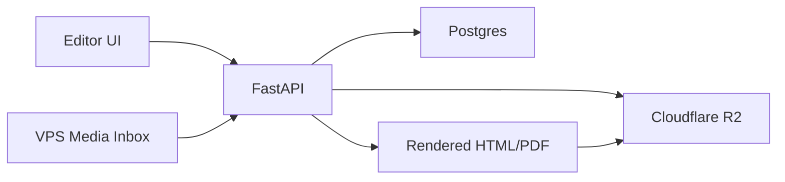

# 01. Target Architecture

## 1. Boi canh hien tai

Hien tai quotation v2 dang co cac dac diem sau:

- `FastAPI` tap trung trong `main.py`
- Production dang duoc thiet ke quanh `Vercel`
- State duoc giu bang:
  - legacy V1 file trong `published/`
  - legacy GitHub persistence cho V1/publication compatibility
- V2 da co Postgres persistence, Alembic migrations va R2 storage boundary;
  cutover/deployment verification van la cong viec van hanh rieng.

He qua:

- Editor save/load khong co source of truth ro rang
- Khong query/managment duoc quotation va media nhu 1 he thong backend chuan
- Khong phu hop voi workflow autosave, versioning, media inventory, gallery picker

## 2. Muc tieu kien truc moi

Kien truc dich:

- `FastAPI app`
- `Postgres`
- `Cloudflare R2`
- `Nginx`
- `Docker Compose`
- `1 VPS`

Mo hinh luu tru:

- Postgres:
  - quotation records
  - document revisions
  - editor autosave
  - media metadata
  - publication records
- R2:
  - original images
  - thumbnail preview images
  - published HTML/PDF artifacts neu can archive
- VPS local disk:
  - inbox folder de dong bo file
  - cache tam
  - logs/backup scripts

## 3. Kien truc logic



## 4. Boundary trach nhiem

### FastAPI

- Xu ly request API
- Quan ly transaction Postgres
- Validate payload editor
- Upload file len R2
- Tao thumbnail preview
- Render quotation HTML/PDF
- Tra gallery/image inventory cho editor

### Postgres

- Source of truth cho quotation v2
- Luu state editor, revision, publication, media metadata

### R2

- Source of truth cho object binary
- Khong luu metadata nghiep vu chinh o day

### Nginx

- TLS termination
- Reverse proxy vao FastAPI
- Co the phuc vu file cache local neu can, nhung khong duoc la canonical storage

## 5. Repo structure muc tieu

Tach dan code khoi `main.py` theo structure sau:

```text
app/
  api/
    routes/
      quotations.py
      media.py
      health.py
  core/
    config.py
    logging.py
  db/
    base.py
    session.py
    models/
      quotation.py
      media.py
      publication.py
    repositories/
      quotation_repository.py
      media_repository.py
  schemas/
    quotation.py
    media.py
  services/
    quotation_service.py
    media_service.py
    render_service.py
    storage/
      r2_storage.py
      local_media_sync.py
  workers/
    thumbnail.py
  main.py
alembic/
docker/
```

Neu chua muon doi repo qua nhieu trong phase dau, co the ap dung structure trung gian:

```text
db/
services/
repositories/
routers/
alembic/
```

## 6. Chinh sach du lieu

### Source of truth

- `quotation document current`: Postgres
- `quotation revision history`: Postgres
- `media metadata`: Postgres
- `original image`: R2
- `preview image`: R2
- `published artifacts`: R2

### Khong duoc coi la canonical

  - `published/*.json` va `published/*.html` cua legacy V1
- local disk trong container app
- in-memory dictionaries trong process

## 7. Pham vi refactor phase 1

Phase 1 chi tap trung quotation v2 va media management:

- `POST /api/v2/quotations`
- `GET /api/v2/quotations/{id}/document`
- `PUT /api/v2/quotations/{id}/document`
- `POST /api/v2/quotations/{id}/publish`
- `POST /api/v2/media/upload`
- `GET /api/v2/media`
- `POST /api/v2/media/sync`
- `POST /api/v2/media/{asset_id}/select`

Itinerary va legacy v1 giu boundary rieng; khong refactor dong loat hoac de V1
fallback im lang vao V2.

## 8. Quy uoc migration

- `quotation v2` moi se doc/ghi bang Postgres
- Du lieu cu tu `published/<id>/ctx.json` va `document.json` se migrate theo script
- Sau khi cutover, code v2 khong quay lai doc file JSON lam fallback im lang
