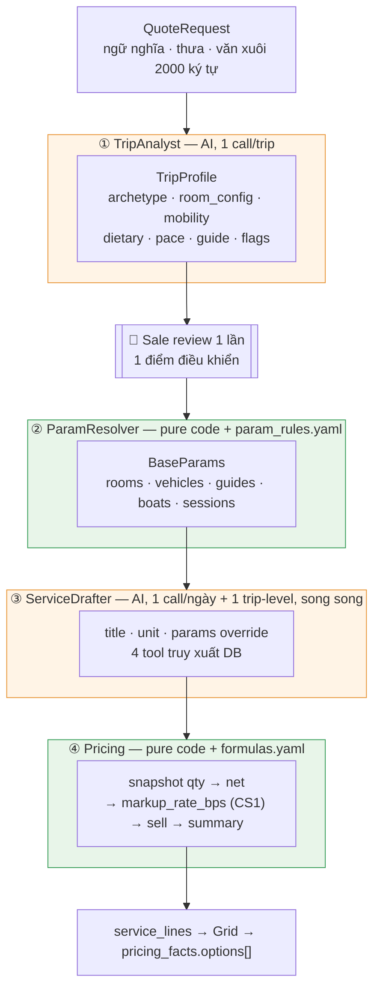
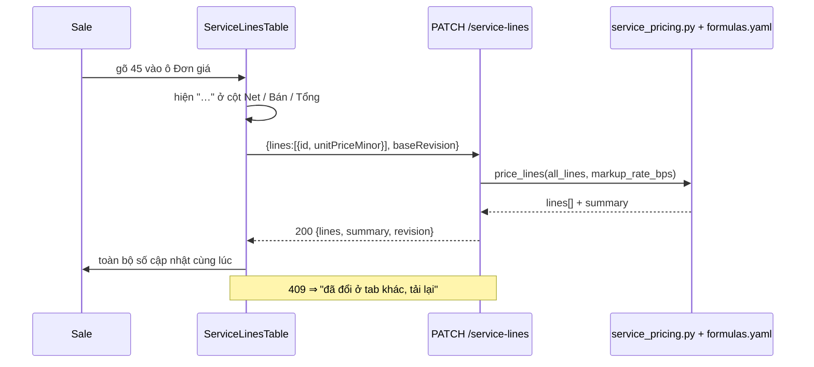

# 14. AI Service Drafter & Costing Engine

> **Loại tài liệu**: Bản tổng quan implementation — tham chiếu cho implementation plan chi tiết sau này.
> **Spec nghiệp vụ đầy đủ**: [../../service-picker-costing-engine.md](../../service-picker-costing-engine.md) (v3).
> **Mô hình catalog & booking (Phase 2 / 2.5)**: [14.0-dmc-catalog-and-booking-model.md](./14.0-dmc-catalog-and-booking-model.md).
> Tài liệu này chốt: kiến trúc BE/FE, UI/UX, điểm clean code, done criteria E2E, rủi ro và test kèm theo.

**Một câu**: `QuoteRequest` là dữ liệu ngữ nghĩa và thưa. Công thức giá cần dữ liệu cấu trúc và đặc. Khoảng cách giữa hai thứ đó là nơi AI tạo giá trị — không phải ở việc chọn khách sạn.

---

## 1. Scope chốt

| # | Chốt | Ràng buộc thi hành |
| :-: | :-- | :-- |
| 1 | **Pydantic AI** làm agent runtime | Dùng lại `llm_client.get_model()` — điểm construct provider duy nhất |
| 2 | **Unified model** cho 10 category | 1 schema `ServiceDraft`, 1 bảng `service_lines`, 1 agent class |
| 3 | **Chỉ 1 main option** mỗi dịch vụ | Không sinh `alternates[]`. Swap = search on-demand |
| 4 | **Không blocking khi draft** | Apply gate = `sell_total_minor > 0`; publish gate còn bắt buộc coverage tối thiểu của costing |
| 5 | **Công thức số lượng sửa được không deploy** | `formulas.yaml` + `param_rules.yaml`, eval bằng `simpleeval`; không chứa markup |
| 6 | **Clean code, quick win** | Không mirror PY↔TS. Server-authoritative pricing |
| 7 | **Không hard-code rule chống trùng** | Đưa dữ kiện vào day context, không viết rule hậu kiểm |
| 8 | **Tools truy xuất DB chính xác** | Filter ở SQL, LLM nhận danh sách đã khoanh vùng ≤ 8 dòng |
| 9 | **Tách bước phân tích ngữ nghĩa** | `TripProfile` — 1 call/trip, sale review 1 lần |
| 10 | **Markup per quotation** | `quotation_costing_settings.markup_rate_bps` (CS1), integer snapshot; không per-line, không live từ YAML. Xem §7 |

**Ngoài scope**: fine-tune model · vector DB riêng · margin optimizer · durable workflow runtime · đa tiền tệ trong Phase 1.

---

## 2. Rà soát source code — cái gì đã có, cái gì làm mới

### 2.1 Tái dùng nguyên (không sửa)

| Thành phần | Vị trí | Dùng để |
| :-- | :-- | :-- |
| `pydantic_ai.Agent` + typed output | `services/section_content_generator.py:256` | Khuôn mẫu cho 2 agent mới. Copy pattern, không copy code |
| `llm_client.get_model()` | `llm_client.py:8` | DeepSeek + fallback OpenAI. **Không** tạo provider ở chỗ khác |
| `PromptLoader` / `PromptBundle` | `prompts/loader.py:37` | Nạp 2 prompt YAML mới |
| `ContentGenerationError` pattern | `services/section_content_generator.py:18` | Output không hợp lệ ⇒ persist nothing |
| `rooming_heuristic_service` | `services/rooming_heuristic_service.py` | **Fallback** cho `TripProfile` khi analyst lỗi |
| `party_rules.generate_party_label` | `core/rules/party_rules.py:29` | Nhãn đoàn trên UI, không tính lại |
| `staysReconciler` / `tripReconciler` | `quote-generator/lib/rules/` | Sinh day grid + overnight cluster cho day context |
| `pricingReconciler` | `quote-generator/lib/rules/pricingReconciler.ts:184` | `inferOptionRatesFromTotal` chia perAdult/perChild — **không viết lại** |
| `currency_divisor` / `SUPPORTED_CURRENCIES` | `core/rules/`, `pricingReconciler.ts:8` | Minor units. Không tự định nghĩa |
| `require_owned_quotation`, `_get_db_session_factory`, `_v2_error_payload` | `main.py` qua `_get_helpers()` | Auth + session + error envelope |
| `DocumentRevisionConflictError` → 409 | `repositories/errors.py` | Optimistic concurrency |
| `outbox_service` | `services/outbox_service.py` | Task *"Bổ sung tariff"* — không gọi notification trực tiếp |

### 2.2 Mở rộng (sửa nhẹ)

| Thành phần | Việc cần làm |
| :-- | :-- |
| `core/rules/service_candidate_rules.py` | Đang là Gate 5 placeholder (`ServiceType` 6 giá trị, `ServiceCandidateEvaluator` Protocol). Mở rộng `ServiceType` đủ 10 category; `CatalogRepository` hiện thực Protocol ở Phase 2 |
| `db/models/destination.py` | Thêm cột phục vụ `get_destination_brief`: `poi_json` (POI + cường độ vận động + số bậc thang + thời lượng), `visa_policy_json`, `season_note` |
| `tests/test_v2_api_manifest_contract.py` | Thêm 6 operation mới ở §3.3 |
| `prompts/v1/` | Thêm `trip_analyst.yaml`, `service_drafter.yaml` |

### 2.3 Làm mới

```
BE (10 file)
  schemas/trip_profile.py                 # TripProfile, RoomAllocation
  schemas/service_draft.py                # ServiceDraft, DayDraftResult
  pricing/param_rules.yaml                # tầng B — cách suy số lượng
  pricing/formulas.yaml                   # công thức qty + rounding (không markup)
  core/rules/param_resolver.py            # merge 3 tầng A/B/C
  core/rules/service_pricing.py           # engine giá, pure, ~110 dòng
  db/models/service_line.py               # lines + formula snapshot
  db/models/quotation_costing_settings.py # CS1 per quotation
  repositories/service_line_repository.py
  services/trip_analyst.py                # agent 1
  services/service_drafter.py             # agent 2 + 4 tool
  routers/v2/services.py

FE (5 file)
  lib/types/service.ts
  lib/hooks/useServiceLines.ts
  components/quotation-workspace/services/TripProfileCard.tsx
  components/quotation-workspace/services/ServiceLinesTable.tsx
  components/quotation-workspace/services/ServiceLineRow.tsx
```

### 2.4 Dependency mới

`simpleeval` — 1 file, không dependency, sandbox sẵn (chặn `__import__`, chặn attribute access). Đây là dependency mới **duy nhất**. Không tự viết AST walker.

---

## 3. Kiến trúc Backend

### 3.1 Bốn bước, hai loại trách nhiệm



### 3.2 Phân tầng đúng convention repo

```
routers/v2/services.py          parse · auth · respond. KHÔNG business logic
  ↓  _get_helpers() → main       require_owned_quotation · _get_db_session_factory · _v2_error_payload
services/trip_analyst.py        LLM orchestration
services/service_drafter.py     LLM orchestration + tool wiring
core/rules/param_resolver.py    PURE — không I/O, không session
core/rules/service_pricing.py   PURE — không I/O, không session, không datetime.now()
repositories/service_line_repository.py   CHỈ query
db/models/service_line.py
```

**Bắt buộc**: `def _get_helpers(): import main` ở function scope. **Không** `import main` ở module level trong router.

### 3.3 API surface (6 operation mới)

| Method | Path | Vai trò |
| :-- | :-- | :-- |
| `POST` | `/api/v2/quotations/{id}/trip-profile:analyze` | Chạy TripAnalyst, ghi `TripProfile` |
| `PATCH` | `/api/v2/quotations/{id}/trip-profile` | Sale sửa profile ⇒ **tính lại toàn bộ** service lines |
| `POST` | `/api/v2/quotations/{id}/service-lines:draft` | Chạy ServiceDrafter cho toàn trip (SSE stream theo ngày) |
| `GET` | `/api/v2/quotations/{id}/service-lines` | Đọc lines + summary |
| `PATCH` | `/api/v2/quotations/{id}/service-lines` | Sửa 1..n dòng (giá, qty, title, tariff) ⇒ trả lines + summary mới |
| `POST` | `/api/v2/quotations/{id}/service-lines:apply-pricing` | Ghi `sell_total` vào `pricing_facts.options[]` — xem §7 |

Mọi mutation costing nhận `baseRevision = CS1.costing_revision`. Xung đột ⇒ `409 REVISION_CONFLICT` + `recovery: "reload"` qua `main._v2_error_payload`. Không dùng `QuotationDocument.revision` vì nó theo `(quotation_id, lang)`.

Cập nhật `tests/test_v2_api_manifest_contract.py` — đây là frozen contract, sửa phải chủ ý.

### 3.4 Ba tầng sở hữu biến — trái tim của thiết kế

| Tầng | Chủ sở hữu | Biến | Sửa ở đâu |
| :-: | :-- | :-- | :-- |
| **A** | Code thuần | `pax` `adults` `children` `nights` `days` `legs` `segments` `meals` | Không sửa — định nghĩa đóng |
| **B** | `param_rules.yaml` | `rooms` `vehicles` `guides` `boats` `sessions` | **Sửa YAML** |
| **C** | AI per-day | override tầng B khi ngày đó khác thường, **bắt buộc `note`** | Sale sửa trên grid |

```python
# core/rules/param_resolver.py
AUTO_OWNED = frozenset({"pax", "adults", "children", "infants",
                        "nights", "days", "legs", "segments", "meals"})

def merge_params(profile, day_ctx, draft) -> tuple[dict[str, int], dict[str, str]]:
    """Trả (params, params_source). Tầng A LUÔN ghi đè cuối, không thương lượng."""
    b = base_params_from_rules(profile, day_ctx)          # tầng B
    c = {k: v for k, v in draft.params.items() if k not in AUTO_OWNED}   # tầng C, lọc
    a = auto_params(day_ctx, profile)                     # tầng A
    merged = {**b, **c, **a}
    source = {**{k: "rules" for k in b}, **{k: "ai" for k in c}, **{k: "auto" for k in a}}
    return merged, source
```

`pax` lấy từ `TripProfile.room_config`, **không** từ `QuoteRequest.adults` — form thường nhập thiếu người (ông bà, bạn đi cùng nằm trong văn xuôi).

### 3.5 Bốn tool

| Tool | Nguồn dữ liệu | Có sẵn? | Trả về |
| :-- | :-- | :-- | :-- |
| `get_destination_brief` | `destination_catalog` (+cột mới) | ✅ mở rộng | POI đã lọc theo `mobility_level` + `interests` |
| `find_similar_past_days` | `service_lines` + `quotations` | ✅ tự đầy từ Phase 1 | Dịch vụ đã bán ở điểm này cho archetype này, kèm tần suất |
| `get_transport_options` | `route_options` (bảng mới, seed ~50 dòng) | ❌ mới | Đường bộ / tàu / bay / phà + khoảng cách + phù hợp mobility |
| `find_services` | `products` + `rates` + `rate_price_lines` | ❌ Phase 2 | Catalog đã hard-filter dietary + accessibility |

**Ba luật cho mọi tool**: filter ở SQL không ở LLM · trả ≤ 8 dòng · **không trả giá tuyệt đối**, chỉ `price_band`.

`find_similar_past_days` là tool giá trị nhất — nó thay prompt engineering bằng dữ liệu thật của chính công ty, và tự tốt lên mà không ai sửa prompt.

### 3.6 Bỏ hard rule, đưa dữ kiện vào context

Day context gửi cho agent mô tả **trạng thái**, không phải mệnh lệnh:

```yaml
day: 3
destination: "Ha Long Bay"
overnight_type: cruise                              # hotel | cruise | train | none
meals_already_covered: [breakfast, lunch, dinner]
transport_already_covered: true
previous_day_stay_includes: [breakfast]
```

Agent không đề xuất bữa nào vì **không còn bữa nào để đề xuất** — không cần rule xoá hậu kiểm. Dữ kiện lấy từ `staysReconciler` đã có.

> Rule là thứ ta viết khi lười đưa dữ kiện.

---

## 4. Kiến trúc Frontend

### 4.1 Ranh giới bất khả xâm phạm

| Hợp đồng | Áp dụng |
| :-- | :-- |
| **Display isolation** | Toàn bộ code mới ở `components/quotation-workspace/services/**`. **Không** import vào `components/display/**`. `npm run lint:display-system` chốt chặn |
| **Typography SSOT** | Chỉ `typo-*` từ `config/typography.ts`. Không `text-sm` / `font-bold`. `npm run lint:typography` |
| **Colors** | Chỉ design token. `npm run lint:colors` |
| **No useEffect derivation** | `summary` đến từ server response, giữ trong state cùng `lines`. Không `useEffect` để đồng bộ |
| **Key ổn định** | `key={line.id}`, không `key={index}` |
| **Component reuse** | `TariffSwapSelect` theo 5 Golden Standards: headless `useTariffSearch.ts` · `onChange(id, tariff?)` · size/variant · listener chỉ khi `isOpen` · keyboard nav |

### 4.2 Server-authoritative — không có hàm tính giá nào ở FE



**Vì sao không mirror sang TS**: mirror chống lại chốt 5. Công thức sống ở 2 nơi thì sửa `formulas.yaml` không còn là "sửa 1 chỗ", và cần shared test vector để giữ 2 bên khớp — đúng loại nợ mà chốt 6 muốn tránh.

Latency ~150ms, che bằng `…` trên các ô phái sinh. Nếu sau này chậm thật: **debounce 300ms + batch nhiều ô vào 1 PATCH**, không phải port reconciler sang TS.

### 4.3 Vị trí trong app

```
app/workspace/quotations/[quotationId]/   ← tab "Dịch vụ & Giá vốn" mới
  └─ QuotationWorkspaceClient.tsx (đã có) → thêm tab
       └─ services/
            TripProfileCard.tsx        # 1 điểm điều khiển
            ServiceLinesTable.tsx      # grid phẳng gom theo ngày
            ServiceLineRow.tsx         # 1 dòng, memo
            TariffSwapSelect.tsx       # Phase 2
```

Heavy client island ⇒ `dynamic(..., { ssr: false })` nếu bundle vượt ngưỡng.

---

## 5. UI/UX chốt

### 5.1 TripProfileCard — một điểm điều khiển

```
┌─ Tính chất chuyến đi ─────────────────────────── ● 86%  [Phân tích lại] ┐
│  [Đa thế hệ ▾]  [Nhịp thư thả ▾]  [HDV suốt tuyến · EN ▾]               │
│  ⚠️ Đi lại hạn chế   🍽 Không hải sản, không cay   🎉 Kỷ niệm 45 năm     │
│  ✈️ Fast-track   📱 SIM                                                  │
│                                                                          │
│  Phòng                                                     [Sửa]         │
│    1 × Double      ông bà (72, 70)                                       │
│    2 × Connecting  bố mẹ + 2 bé (4, 11)   +1 extra bed                   │
│    → "3 thế hệ: ông bà phòng riêng; bố mẹ nối phòng với 2 bé…"           │
│                                                                          │
│  ❓ Chưa rõ quốc tịch để xác định visa                      [Bổ sung]     │
│  ⚠️ Yêu cầu ghi 6 khách nhưng form nhập 2 người lớn.        [Sửa form]   │
└──────────────────────────────────────────────────────────────────────────┘
```

Sale đổi `archetype` hoặc kéo `room_config` ⇒ **toàn bộ dòng tính lại**. Một thao tác, không phải bảy mươi.

Ba cảnh báo đều là dữ liệu `TripProfile` sẵn có (`unknowns`, `confidence`, lệch `adults` vs văn xuôi) — không cần cơ chế mới.

### 5.2 ServiceLinesTable — bảng phẳng gom theo ngày

```
┌──────────────────────────────────────────────────────────────────────────────┐
│ QUO-2451 · Gia đình Nguyễn · 6 pax · 8 ngày · USD             Markup 20.0%  │
│ ⬤ 3 dòng chưa giá  ◐ 2 dòng cần kiểm tra SL     NET 7,873   BÁN 9,841 [Áp giá]│
├──┬──────────┬────────────────────────────────┬────┬────────┬───────┬─────────┤
│  │ Danh mục │ Dịch vụ                        │ SL │ Đơn giá│  Net  │   Bán   │
├──┴──────────┴────────────────────────────────┴────┴────────┴───────┴─────────┤
│ ▼ NGÀY 1 · 15/03 · Hà Nội · ngủ: Metropole                          $ 1,204  │
│   🏨 Accom   Sofitel Metropole – Premium      │  3 │   285  │  855  │  1,069  │
│   🚐 Trans   Ford Transit 16 – đón sân bay    │  1 │    65  │   65  │     81  │
│   🍽 Meal    Ăn tối – Chim Sao (không cay)    │  6 │ ⬤   0  │    0  │      0  │
│ ▼ NGÀY 3 · 17/03 · Hạ Long · ngủ: Heritage cruise                   $ 1,463  │
│   🛳 Accom   Heritage Bình Chuẩn – Regal      │  3 │   390  │1,170  │  1,463  │
│              ⓘ bữa & di chuyển đã gồm trong cruise                            │
│ ▼ NGÀY 5 · 19/03 · Hội An → Huế                                     $   225  │
│   🚐 Trans   Xe 29 chỗ – đèo Hải Vân          │  1 │   180  │  180  │    225  │
│              💬 "Nâng từ 16 lên 29 chỗ: chặng 4h, ông bà cần ghế ngả"        │
│ ▼ TOÀN TRIP                                                          $   188 │
│   🛂 Visa    e-Visa Việt Nam                  │  6 │    25  │  150  │    188  │
└──────────────────────────────────────────────────────────────────────────────┘
   ⬤ chưa có giá   ◐ SL tính fallback   💬 AI override có lý do   ✎ sale đã sửa
```

Ngày 3 không có dòng Meal/Transport — **không phải vì rule xoá**, mà vì agent thấy `meals_already_covered` nên không đề xuất. Dòng `ⓘ` chỉ là chú thích.

### 5.3 Ba trạng thái giá — thay toàn bộ warning system

| `price_source` | Nghĩa | UI |
| :-- | :-- | :-- |
| `catalog` | Join được tariff | Bình thường |
| `manual` | Sale gõ tay | Badge xám *tự nhập* |
| `missing` | `unit_price_minor = 0` | Ô input **vàng** — không phải lỗi, là **việc cần làm** |

Filter duy nhất: **"Chỉ hiện dòng chưa có giá (3)"**.

### 5.4 Tương tác

| Thao tác | Hành vi |
| :-- | :-- |
| Gõ giá ô vàng | `missing → manual` · toast *"Lưu vào bảng giá?"* → 1 click upsert `products` + `rates` + `rate_price_lines` (Phase 2) |
| Sửa `qty` | Ghi đè trực tiếp, `params_source[qty] = "staff"` |
| Đổi dịch vụ | `TariffSwapSelect` search on-demand (Phase 2) |
| Thêm / xoá dòng | `origin: staff` |
| Click `qty` | Tooltip truy vết: `9 = rooms(3) × nights(3)` · `rooms ← Tính chất chuyến đi` · `nights ← Cụm lưu trú ngày 1–3` |
| Soạn lại 1 ngày | Nút trên header nhóm ngày |
| **Áp giá** | Ghi `sell_total` vào `pricing_facts.options[]` — xem §7 |

### 5.5 Streaming — không có màn hình chờ đen

`:draft` trả SSE. Grid render khung ngày ngay, từng nhóm ngày điền dần khi agent trả về. Ngày lỗi ⇒ nhóm rỗng + nút *Soạn lại ngày này*.

---

## 6. Data model

### 6.1 `service_lines` — 1 bảng

```python
class ServiceLine(Base):
    __tablename__ = "service_lines"

    id, quotation_id (FK CASCADE, index), revision
    day:              int | None       # None ⇒ trip-level
    category:         str(24)
    title:            str(255)
    tariff_id:        str(64) | None

    unit:             str(32)
    params:           JSONB            # đã merge cả 3 tầng
    params_source:    JSONB            # {"rooms":"rules","vehicles":"ai","nights":"auto"}
    qty:              int
    qty_fallback:     bool
    formula_version:  str(64)           # snapshot at draft/edit

    unit_price_minor: BigInteger       # 0 khi chưa có giá
    currency:         str(3)
    price_source:     str(16)          # catalog | manual | missing

    origin:           str(8)           # ai | staff
    note:             str(200)
    confidence:       float
    sort_order:       int
```

**Không** cột `markup_rate` trên dòng (chốt 10). CS1 giữ `markup_rate_bps` per quotation. **Không** persist `net_minor` / `sell_minor`; GET chỉ tính từ `qty` snapshot + CS1, không eval YAML live.

`params_source` là cột duy nhất phục vụ truy vết, rẻ hơn một hệ thống audit log.

### 6.2 `TripProfile` — lưu ở đâu

Ghi vào baseline `quotation_documents.document_json.trip_profile` (không tạo bảng mới). Vì profile là costing input, update phải CAS `CS1.costing_revision` và update document trong cùng transaction; document conflict cũng trả 409/reload. Không dùng revision theo language làm quotation-wide costing token.

### 6.3 Hai file config

```yaml
# pricing/formulas.yaml — công thức tính
qty:
  per_person:           "pax"
  per_room_per_night:   "rooms * nights"
  per_vehicle_per_day:  "vehicles * days"
  per_guide_per_day:    "guides * days"
  per_person_per_meal:  "pax * meals"
  per_boat:             "boats"
  per_group:            "1"
  flat:                 "1"            # escape hatch, luôn dùng được
rounding:
  per_line: half_up
  per_person_to: { VND: 100000, USD: 1, EUR: 1 }

# pricing/param_rules.yaml — cách suy số lượng (tầng B)
vehicles:
  - when: "mobility_level == 'limited'"
    seats: 16                          # xe sàn thấp, lên xuống dễ
  - when: "pax <= 4 and days > 10"
    seats: 7                           # tour dài ⇒ nhiều hành lý ⇒ hạ tải
  - when: "pax <= 8"
    seats: 16
  - default: { seats: 45 }
  formula: "ceil(pax / (seats - luggage_seats))"

archetype_overrides:                   # ⭐ "4 người ≠ 4 người" thành cấu hình
  multi_generation: { guides: "+1 khi pax > 8", vehicles_min_seats: 16 }
  honeymoon:        { rooms_force: [{ room_type: double, count: 1 }] }
```

Cùng một `simpleeval` cho cả hai file — một cơ chế, hai file config.

### 6.4 Luật vàng của engine

```python
def resolve_qty(unit, params, cfg) -> tuple[int, bool]:
    """Trả (qty, is_fallback). KHÔNG BAO GIỜ raise."""
    expr = cfg.qty.get(unit)
    if not expr:
        return 1, True
    try:
        return max(1, int(simple_eval(expr, names=params))), False
    except Exception:
        return 1, True
```

> Công thức không tính được ⇒ `qty = 1` + cờ `qty_fallback` ⇒ chấm cam `◐` trên grid. Không raise, không block. Chốt 4 và 5 gặp nhau ở đúng đây.

---

## 7. Tích hợp CS1 và `pricing_facts` — điểm rủi ro cao nhất

### 7.1 Repo đã có tầng thương mại

`quote-generator/lib/rules/pricingReconciler.ts:49` hiện còn legacy commercial fields:

```ts
options: CanonicalPricingOption[]   // max 3, mỗi option có perAdultMinor/perChildMinor/groupTotalMinor
legacy gross-profit fields, commission, contingency, paymentFee
pricingType: "Gross" | "Net" | "Commissionable"
```

Legacy gross-profit metadata **không phải** pricing input của module này. `service_lines` là **giá vốn (net)**. `pricing_facts.options[]` là **giá bán**. CS1 là SSoT markup quotation-wide.

### 7.2 Luồng "Áp giá"

```
Σ service_lines.net_minor
   → CS1.markup_rate_bps (per quotation snapshot)
   → sell_total_minor
   → ghi vào MỘT CanonicalPricingOption (id cố định: "opt-from-services")
   → pricingReconciler.inferOptionRatesFromTotal(sell_total, adults, children, childRatio)
   → perAdultMinor / perChildMinor
   → brochure hiển thị như hiện tại — KHÔNG đổi gì ở display layer
```

Zero thay đổi ở display, zero UI pricing mới, tái dùng `inferOptionRatesFromTotal` đã có test.

### 7.3 Markup là công thức duy nhất của module

```
Markup% (trên GIÁ VỐN): `sell = net * (10_000 + markup_rate_bps) / 10_000`.

`net = 1000`, `markup_rate_bps = 2000` ⇒ `sell = 1200`.
```

Core chỉ nhận bps integer. API boundary validate `0..9500`; ngoài dải ⇒ 422. Quotation legacy chưa có CS1 dùng 0 bps + warning, không raise. YAML chỉ seed default lúc tạo quotation; YAML đổi không reprice line snapshot cũ.

### 7.4 Ba quy tắc ranh giới

1. **Áp giá là thao tác chủ động của sale**, không tự động. Nó lưu `applied_costing_revision`, markup snapshot, total và timestamp; line/rate đổi sau apply ⇒ option managed bị `stale`.
2. Option `"opt-from-services"` do hệ thống quản lý. Hai option còn lại (max 3) sale tự nhập, module này không đụng.
3. `commission`, `contingency`, `paymentFee` **không** thuộc scope module này và không được implicit áp sau `sell_total` trong Phase 1.

---

## 8. Điểm cần clean code

### 8.1 Bắt buộc trong scope

| # | Việc | Vì sao |
| :-: | :-- | :-- |
| 1 | `core/rules/service_pricing.py` và `param_resolver.py` **pure** — không I/O, không session, không `datetime.now()`, không random | Test được 100%, deterministic, gọi 2 lần cùng input ⇒ output y hệt |
| 2 | Không hàm tính giá nào ở FE | Chốt 5+6. `formulas.yaml` là nguồn duy nhất |
| 3 | `_get_helpers()` function-scope trong router | Convention repo, tránh circular import |
| 4 | Tool trả ≤ 8 dòng, filter ở SQL | Chốt 8. Context không phình, LLM không tự lọc |
| 5 | Prompt render `unit_catalog` + `base_params` từ config | Thêm `unit` vào YAML ⇒ prompt tự biết. **Không tồn tại trạng thái "quên cập nhật prompt"** |
| 6 | `ConfigDict(extra="forbid")` trên mọi schema LLM | Biến "LLM đừng tự tính tiền" từ lời dặn trong prompt thành ràng buộc kiểu dữ liệu |
| 7 | `ServiceLineRow` là component riêng, có `memo` | Grid 70 dòng, sửa 1 ô không re-render 69 dòng kia |
| 8 | File ≤ 400 dòng, hàm ≤ 50 dòng | Convention repo |

### 8.2 Nợ kỹ thuật chạm phải — xử lý ra sao

| Phát hiện | Quyết định |
| :-- | :-- |
| `core/rules/service_candidate_rules.py` là placeholder chết (40 dòng, không ai gọi) | **Mở rộng, không xoá.** `ServiceCandidateEvaluator` Protocol đúng hình dạng cho `CatalogRepository` Phase 2 |
| `llm_client.get_model()` `print()` lỗi thay vì log/raise | **Không sửa trong scope này.** Ghi vào backlog — sửa nó là thay đổi hành vi toàn bộ content generation |
| `main.py` 11k dòng | Không thêm gì vào đó. Toàn bộ code mới ở `routers/v2/services.py` |
| `AGENTS.md` / `quote-generator/AGENTS.md` / `.cursorrules` | Cập nhật **cùng lúc** khi thêm reconciler/rule mới — chúng là bản sao guidance cho agent khác |

---

## 9. Done criteria — full flow E2E

### 9.1 Kịch bản chuẩn

> Sale mở QUO test có `special_requirements`: *"Ông bà nội đi cùng (72 và 70 tuổi), ông đi lại chậm. Cả nhà không ăn cay. Kỷ niệm 45 năm cưới."* Form nhập `adults: 2, children: 2, kid_ages: [4, 11]`. Tuyến Hà Nội → Hạ Long → Hội An, 8 ngày.

### 9.2 Bảng nghiệm thu theo ranh giới

| # | Ranh giới | Tiêu chí PASS | Bằng chứng thu thập |
| :-: | :-- | :-- | :-- |
| 1 | UI → `:analyze` | Trả `TripProfile` trong < 30s | Response body + timing |
| 2 | Ngữ nghĩa → cấu trúc | `pax = 6` (bắt được ông bà trong văn xuôi) · `mobility_level = limited` · `has_elderly = true` · `pace = relaxed` · `special_occasion` khác rỗng | JSON `TripProfile` |
| 3 | Cảnh báo lệch | UI hiện *"Yêu cầu ghi 6 khách nhưng form nhập 2 người lớn"* | Screenshot |
| 4 | Profile → BaseParams | `rooms = 3` (1 Double + 2 Connecting) · `vehicles` dùng xe ≥ 16 chỗ vì `mobility_level = limited` | `params_source` = `"rules"` |
| 5 | `:draft` streaming | Khung 8 ngày render ngay; từng nhóm ngày điền dần | Screenshot 2 mốc thời gian |
| 6 | Phủ danh mục | ≥ 8/10 category xuất hiện ít nhất 1 lần trong toàn trip | `GROUP BY category` |
| 7 | Chống trùng | Ngày ngủ cruise **không** có dòng Meal/Transport nào | Query ngày đó |
| 8 | Tầng A thắng | Cụm 3 đêm ⇒ `params.nights = 3` dù AI trả gì | `params_source[nights] = "auto"` |
| 9 | Zero price hallucination | 100% dòng có `price_source = "missing"` và `unit_price_minor = 0` khi catalog rỗng | `SELECT ... WHERE unit_price_minor > 0` trả 0 dòng |
| 10 | Sale gõ giá | PATCH 1 ô ⇒ `net`/`sell`/`summary` toàn bảng cập nhật < 500ms | Network timing |
| 11 | Sửa profile ⇒ tính lại | Đổi `archetype` → `couple` ⇒ `rooms` giảm, **toàn bộ** dòng Accommodation đổi `qty` | Diff trước/sau |
| 12 | Fallback không vỡ | Ép `unit = "bịa_ra"` ⇒ `qty = 1`, `qty_fallback = true`, `◐` trên UI, **không exception** | Log + screenshot |
| 13 | Agent lỗi 1 ngày | Kill agent ngày 5 ⇒ 7 ngày kia vẫn có dòng, ngày 5 rỗng + nút soạn lại | Log |
| 14 | Publish gate | `sell_total = 0` ⇒ nút Áp giá disabled. Gõ ≥ 1 giá ⇒ enabled | Screenshot |
| 15 | Áp giá → `pricing_facts` | `pricing_facts.options[]` có `opt-from-services`; `groupTotalMinor` = `Σ sell`; `perAdultMinor` do `inferOptionRatesFromTotal` sinh | JSON document |
| 15a | Publish coverage gate | Catalog rỗng + một giá gõ tay không đủ publish nếu coverage policy còn thiếu | GateResult + UI |
| 16 | Markup snapshot đúng công thức | `net = 1000`, `markup_rate_bps = 2000` ⇒ `sell = 1200` | Unit test + response |
| 17 | Brochure | Trang public hiển thị giá mới, **0 thay đổi** ở `quote-generator/components/display/**` | Gate `display-drift` ([14.6 §6.1](./14.6-sprint-6-apply-pricing-and-e2e.md)) exit 0 |
| 18 | Optimistic concurrency | 2 tab cùng PATCH ⇒ tab sau nhận 409 + `recovery: "reload"` | Response |
| 19 | Lint chain | `npm run lint` (đủ 6 bước) xanh — eslint alone **không** phải pass | Output |
| 20 | Test chain | `PYTHONPATH=. pytest` + `npm test` xanh; contract suite ở `CLAUDE.md` xanh | Output |
| 21 | Zero-LLM mode | `DRAFTER_MODE=off` ⇒ grid mở với skeleton rỗng, sale làm tay được | Screenshot |

**Ngưỡng chất lượng** (đo trên 10 tour thật đã bán):
- `TripProfile` bắt được khách "ẩn" trong văn xuôi: ≥ 8/10 ca
- AI sinh ≥ 80% số dòng dịch vụ sale thực sự cần
- p95 `:analyze` + `:draft` < 35s cho tour 10 ngày

### 9.3 Quy tắc dừng khi verify

Dừng ở **ranh giới hỏng đầu tiên**, báo cáo kèm bằng chứng và fix cụ thể — không chạy tiếp qua chỗ đã gãy. Nếu hai tầng liên tiếp không cho tín hiệu nào (không log, không lỗi, không output) ⇒ đó là lỗ hổng quan sát, bổ sung logging trước khi verify tiếp.

---

## 10. Rủi ro và test bắt buộc

| # | Rủi ro | Mức | Khắc chế | Test |
| :-: | :-- | :-: | :-- | :-- |
| 1 | **GP vs markup** — dùng nhầm công thức ⇒ sai tiền mọi quotation | 🔴 | Chỉ một hàm `apply_markup()`; contract test cấm GP-style formula | `test_markup_bps_formula`: `net=1000, 2000bps → 1200` |
| 2 | **`TripProfile` sai ⇒ 70 dòng lệch** | 🔴 | Là single point of failure **và** single point of fix. `reasoning` + `confidence` + `unknowns` hiển thị; sale sửa 1 chip | `test_profile_change_recomputes_all_lines` |
| 3 | **`qty_fallback` im lặng** — `qty=1` sai mà không ai biết | 🟠 | Cờ boolean + `◐` trên ô + **đếm dồn lên header** | `test_fallback_flag_propagates_to_summary` |
| 4 | **AI ghi đè biến tầng A** | 🟠 | `AUTO_OWNED` lọc ở `merge_params`, tầng A ghi đè cuối | `test_auto_params_always_win`: AI trả `nights=99` ⇒ vẫn ra `nights` thật |
| 5 | **LLM bịa giá** | 🔴 | 2 lớp: `extra="forbid"` + schema không có trường tiền · tool không trả `unit_price` | `test_schema_has_no_money_field` grep `/(price\|amount\|cost\|total\|minor\|fee)/` trên `model_fields` |
| 6 | **Làm tròn sai** — tổng ≠ Σ dòng hiển thị trên brochure | 🟠 | Làm tròn **từng dòng**, cộng sau | `test_line_rounding_sums_to_total` |
| 7 | **Per-day agent nhân đôi dịch vụ trip-level** | 🟠 | Pass trip-level riêng với `day = null`; dedupe theo `(category, title)` | `test_trip_level_deduped` |
| 8 | **`simpleeval` chạy biểu thức độc** | 🟠 | Expression đến từ **file config trong repo**, không từ user/LLM. Whitelist tên biến. Giới hạn độ dài | `test_param_rules_yaml_evaluates` — mọi `when:` eval được với profile giả |
| 9 | **Prompt lệch config** — thêm `unit` mà prompt không biết | 🟡 | `unit_catalog` render từ `formulas.yaml` | `test_prompt_renders_all_units` |
| 10 | **Sửa markup đổi giá quotation đã gửi khách** | 🟠 | Published quotation phải tạo business successor; apply là thao tác chủ động và option stale sau mutation | `test_published_costing_requires_successor` |
| 11 | **Analyst lỗi ⇒ tắc cả luồng** | 🟡 | Fallback `rooming_heuristic_service` + `confidence: 0` + banner | `test_analyst_failure_falls_back` |
| 12 | **Grid 70 dòng lag khi gõ** | 🟡 | `ServiceLineRow` memo + debounce 300ms + batch PATCH | Đo thủ công ở §9 mục 10 |
| 13 | **Regression display layer** | 🟠 | `npm run lint:display-system` | Gate `display-drift` exit 0 |
| 14 | **Route mới phá frozen contract** | 🟡 | Cập nhật manifest có chủ ý | `test_v2_api_manifest_contract.py` |

### 10.1 Bộ test tối thiểu

```bash
# Backend — pure rules
PYTHONPATH=. pytest tests/test_service_pricing.py \
                    tests/test_param_resolver.py \
                    tests/test_service_draft_contract.py

# Backend — contract không được vỡ
PYTHONPATH=. pytest tests/test_v2_api_manifest_contract.py \
                    tests/test_v2_error_envelope.py \
                    tests/test_domain_rules.py \
                    tests/test_business_gates.py \
                    tests/test_ssot_integrity.py

# Frontend
cd quote-generator && npm run lint && npm test && npm run build
```

---

## 11. Thứ tự triển khai

| Bước | Nội dung | Chặn bước sau? |
| :-: | :-- | :-- |
| 1 | `formulas.yaml` + `param_rules.yaml` + `service_pricing.py` + `param_resolver.py` + test | ✅ Mọi thứ phụ thuộc |
| 2 | `service_line.py` + Alembic + repository | ✅ |
| 3 | `trip_profile.py` + `trip_analyst.py` + prompt YAML | ✅ |
| 4 | `service_draft.py` + `service_drafter.py` + 2 tool (`destination_brief`, `similar_past_days`) | |
| 5 | `routers/v2/services.py` + cập nhật manifest contract | |
| 6 | `TripProfileCard` + `ServiceLinesTable` + `useServiceLines` | |
| 7 | `:apply-pricing` → `pricing_facts.options[]` + applied costing snapshot | Cuối cùng — chạm tiền thật |
| 8 | E2E theo §9 | |

**Phase 2** (hợp đồng dữ liệu đầy đủ: [14.0-dmc-catalog-and-booking-model.md](./14.0-dmc-catalog-and-booking-model.md)): catalog 5 bảng `suppliers / products / rates / rate_price_lines / rate_sources` + 3 module pure (`rate_selection`, `rate_validation`, `policy_schedule`) + `find_services` + nút *Lưu vào bảng giá* + `route_options` + `TariffSwapSelect` + CRUD catalog. **Phase 2.5**: `booking_lines` copy-on-confirm.

---

## 12. Checklist review trước merge

| # | Kiểm tra |
| :-: | :-- |
| 1 | `TripProfile` và `ServiceDraft` không có trường tiền, `extra="forbid"` |
| 2 | `auto_params` ghi đè cuối cùng trong `merge_params` |
| 3 | `resolve_qty` không bao giờ raise — mọi nhánh trả `(int, bool)` |
| 4 | Không hàm tính giá nào ở FE |
| 5 | Sửa `formulas.yaml` / `param_rules.yaml` là đủ — không cần sửa Python/TS |
| 6 | `apply_markup()` dùng `net * (10_000 + markup_rate_bps) / 10_000`; không dùng GP |
| 7 | `unit_catalog` + `base_params` render từ config, không hardcode trong prompt |
| 8 | Mọi tool filter ở SQL và không trả giá tuyệt đối |
| 9 | Không rule hậu kiểm chống trùng — dùng day context |
| 10 | `_get_helpers()` function-scope, không `import main` module-level |
| 11 | Gate `display-drift` exit 0 trong CI |
| 12 | Chỉ `typo-*`, chỉ design token · `npm run lint` (đủ 6 bước) xanh |
| 13 | Mutation gửi `baseRevision`, xử lý 409 |
| 14 | `test_v2_api_manifest_contract.py` đã cập nhật |
| 15 | `AGENTS.md`, `quote-generator/AGENTS.md`, `.cursorrules` cập nhật cùng lúc |
| 16 | Task *Bổ sung tariff* đi qua `outbox_events` |
