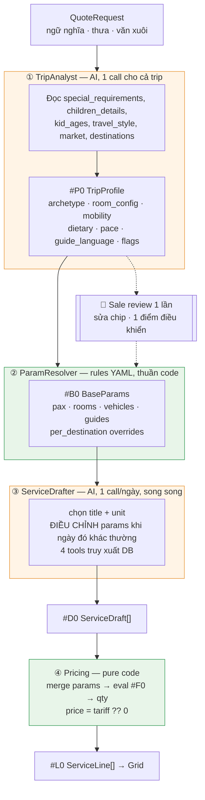

# AI Service Drafter — Technical Specification v3

> **v3 thay thế v2.** Bổ sung tầng còn thiếu: **dữ liệu nào điền vào công thức, và ai chịu trách nhiệm cho từng biến.**
> **Một câu**: `QuoteRequest` là dữ liệu *ngữ nghĩa và thưa*. Công thức giá cần dữ liệu *cấu trúc và đặc*. Khoảng cách giữa hai thứ đó là nơi AI tạo giá trị — không phải ở việc chọn khách sạn.

```
Dict:
  #P0 = TripProfile    — semantic → structured, 1 call/trip, sale review 1 lần
  #B0 = BaseParams     — rules YAML sinh từ #P0
  #D0 = ServiceDraft   — output LLM per-day, KHÔNG có tiền
  #L0 = ServiceLine    — 1 bảng DB
  #F0 = formulas.yaml  — công thức, sửa không deploy
```

---

## 0. Điểm chốt

| # | Chốt | Hệ quả |
| :-: | :-- | :-- |
| 1 | Pydantic AI | Đã có trong repo. 0 dependency mới |
| 2 | Unified model cho 10 category | 1 schema `#D0`, 1 bảng `#L0`, 1 agent class |
| 3 | Chỉ 1 main option | Bỏ `alternates[]`. Swap = search on-demand |
| 4 | Không blocking | Publish gate = `sell_total > 0`. Hết |
| 5 | Công thức dễ sửa | Công thức **và** cách điền biến đều là YAML |
| 6 | Clean code, quick win | 10 file. Không mirror PY↔TS |
| 7 | **Không hard-code rule chống trùng** | Bỏ `HARD_RULES`. Thay bằng **day context giàu hơn** — xem §1.3 |
| 8 | **Tools truy xuất DB chính xác** | 4 tool, filter ở SQL, LLM nhận danh sách đã khoanh vùng |
| 9 | **Tách bước phân tích ngữ nghĩa** | `#P0 TripProfile` — nơi "4 người ≠ 4 người" được giải quyết |

---

## 1. Kiến trúc — ba tầng, ba loại trách nhiệm

### 1.1 Vấn đề cốt lõi

`QuoteRequest` trong repo hiện tại:

```python
destinations:         list[str]        # ["Hanoi", "Halong", "Hoi An"]
start_date/end_date:  str | None
raw_dates_text:       str | None       # "cuối tháng 3, linh hoạt 1-2 ngày"
adults / children:    int | None
kid_ages:             list[int]        # [8, 12]
children_details:     str | None       # "bé lớn bị dị ứng hải sản"
travel_style:         str | None       # "luxury"
market:               str | None       # "AU"
special_requirements: str(2000)        # ⭠ 2000 ký tự văn xuôi, nơi chứa 80% ngữ nghĩa
payload_json:         dict             # phần mở rộng
```

Công thức `rooms * nights` cần một số nguyên `rooms`. Nhưng **4 pax không quyết định được `rooms`**:

| Cùng 4 pax | `rooms` | Vì sao |
| :-- | :-: | :-- |
| 2 couple đi chung | 2 Double | Hai cặp |
| Gia đình 2A + 2C (8, 12) | 1 Family / 2 Connecting | Bố mẹ không tách con |
| 4 bạn nữ | 2 Twin | Không dùng Double |
| 2A + 2C (2, 4) | 1 Double + extra bed | Trẻ nhỏ ngủ chung |
| 3 thế hệ: 2A + 1 elderly + 1C | 1 Double + 1 Twin | Ông bà phòng riêng |

Sự khác biệt nằm ở `special_requirements`, `children_details`, `kid_ages`, `market` — **dữ liệu ngữ nghĩa**. Đây là việc chỉ AI làm được. Còn `4 * 3 = 12` thì code làm.

### 1.2 Ba tầng



**Vì sao tách `#P0` thành bước riêng thay vì để mỗi day-agent tự suy?**

| | Suy trong từng day-agent | **`#P0` một lần** ✅ |
| :-- | :-- | :-- |
| Nhất quán | Ngày 1 hiểu "family", ngày 5 hiểu "2 couple" ⇒ rooms lệch giữa các ngày | Một kết luận, dùng chung |
| Sale sửa | Phải sửa 8 ngày × nhiều dòng | Sửa **1 chip**, toàn trip tính lại |
| Token | Gửi 2000 ký tự `special_requirements` × 8 ngày | Gửi 1 lần, day-context chỉ nhận `#P0` cô đọng |
| Debug | Không biết vì sao ngày 3 khác ngày 4 | `#P0` hiển thị được, có `reasoning` |

`#P0` là **điểm điều khiển duy nhất** cho toàn bộ tính chất chuyến đi.

### 1.3 Bỏ `HARD_RULES` — thay bằng day context giàu hơn (chốt 7)

v2 giữ 3 rule code chống trùng bữa/cruise. **Bỏ hết.** Lý do: chúng không phải rule, chúng là hệ quả của việc agent **không được cho biết đủ dữ kiện**.

Code đã biết những dữ kiện đó từ `staysReconciler` — chỉ cần đưa vào context thay vì viết rule hậu kiểm:

```yaml
# day context gửi cho agent — mô tả TRẠNG THÁI, không phải mệnh lệnh
day: 3
date: "2026-03-17"
destination: "Ha Long Bay"
overnight_type: cruise              # hotel | cruise | train | none
overnight_name: "Heritage Bình Chuẩn"
meals_already_covered: [breakfast, lunch, dinner]   # do stay/cruise/flight bao gồm
transport_already_covered: true                     # cruise lo di chuyển trong ngày
previous_day_overnight_type: hotel
previous_day_stay_includes: [breakfast]
```

Agent thấy `meals_already_covered: [breakfast, lunch, dinner]` thì không đề xuất bữa nào — không cần rule nào bảo nó xoá. Ngày sau thấy `previous_day_stay_includes: [breakfast]` thì bỏ bữa sáng.

> **Nguyên tắc thay thế**: *dữ kiện đầy đủ trong context* rẻ hơn và đúng hơn *rule hậu kiểm trong code*. Rule là thứ ta viết khi lười đưa dữ kiện.

Ba rule biến mất, ba dòng YAML xuất hiện — và chúng đến từ dữ liệu đã có sẵn, không phải logic mới.

---

## 2. `#P0` TripProfile — nơi ngữ nghĩa thành cấu trúc

### 2.1 Schema

```python
# schemas/trip_profile.py
from typing import Annotated, Literal
from pydantic import BaseModel, Field, ConfigDict

Archetype = Literal[
    "solo", "couple", "honeymoon", "family_young_kids", "family_teens",
    "multi_generation", "friends", "corporate", "special_interest",
]

class RoomAllocation(BaseModel):
    model_config = ConfigDict(extra="forbid")
    room_type: Literal["single", "double", "twin", "triple", "family", "suite", "connecting"]
    count: Annotated[int, Field(ge=1, le=20)]
    occupants: Annotated[str, Field(max_length=80)]   # "bố mẹ", "2 bé 8 và 12"
    extra_beds: Annotated[int, Field(ge=0, le=4)] = 0

class TripProfile(BaseModel):
    model_config = ConfigDict(extra="forbid")

    # ── Party ──
    archetype: Archetype
    room_config: list[RoomAllocation]                  # ⭠ AI reason, KHÔNG phải công thức
    rooming_rationale: Annotated[str, Field(max_length=200)]

    # ── Ràng buộc thể chất & chăm sóc ──
    mobility_level: Literal["full", "moderate", "limited"]
    has_elderly: bool
    has_infant: bool
    needs_child_seat: int = 0

    # ── Ẩm thực ──
    dietary: list[Literal[
        "vegetarian", "vegan", "halal", "kosher", "gluten_free",
        "no_pork", "no_seafood", "nut_allergy", "other",
    ]] = []
    dietary_note: Annotated[str, Field(max_length=200)] = ""

    # ── Dịch vụ ──
    guide_language: str                                 # "en" | "ar" | "ru" | "es" …
    guide_mode: Literal["through_guide", "local_per_city", "none"]
    pace: Literal["relaxed", "balanced", "packed"]
    interests: Annotated[list[str], Field(max_length=8)] = []

    # ── Cờ dịch vụ phụ (điều khiển category `others`) ──
    wants_fast_track: bool = False
    wants_sim: bool = False
    wants_insurance: bool = False
    special_occasion: Annotated[str, Field(max_length=80)] = ""

    # ── Truy vết ──
    confidence: Annotated[float, Field(ge=0.0, le=1.0)]
    unknowns: Annotated[list[str], Field(max_length=6)] = []   # "chưa rõ quốc tịch"
    reasoning: Annotated[str, Field(max_length=400)]
```

Không có trường tiền. `budget` không nằm ở đây — ngân sách là việc của sale trên grid, không phải của agent.

### 2.2 Ví dụ thật

**Input** (`QuoteRequest`):
```
destinations: ["Hanoi", "Halong", "Hoi An", "Ho Chi Minh"]
adults: 2 · children: 2 · kid_ages: [4, 11]
children_details: "bé nhỏ hay say xe, bé lớn dị ứng hải sản"
travel_style: "luxury"
market: "AU"
special_requirements: "Ông bà nội đi cùng (72 và 70 tuổi), ông đi lại chậm
  cần tránh leo nhiều bậc. Cả nhà không ăn được cay. Kỷ niệm 45 năm cưới
  của ông bà. Muốn có xe riêng suốt tuyến, không đi tour ghép."
```

**Output** (`#P0`):
```json
{
  "archetype": "multi_generation",
  "room_config": [
    { "room_type": "double",     "count": 1, "occupants": "ông bà (72, 70)", "extra_beds": 0 },
    { "room_type": "connecting", "count": 2, "occupants": "bố mẹ + 2 bé (4, 11)", "extra_beds": 1 }
  ],
  "rooming_rationale": "3 thế hệ: ông bà phòng riêng; bố mẹ nối phòng với 2 bé, bé 4 tuổi dùng extra bed.",
  "mobility_level": "limited",
  "has_elderly": true,
  "has_infant": false,
  "needs_child_seat": 1,
  "dietary": ["no_seafood", "other"],
  "dietary_note": "bé lớn dị ứng hải sản; cả nhà không ăn cay",
  "guide_language": "en",
  "guide_mode": "through_guide",
  "pace": "relaxed",
  "interests": ["family_friendly", "cultural", "scenic"],
  "wants_fast_track": true,
  "wants_sim": true,
  "special_occasion": "kỷ niệm 45 năm ngày cưới của ông bà",
  "confidence": 0.86,
  "unknowns": ["chưa rõ quốc tịch để xác định visa"],
  "reasoning": "6 pax 3 thế hệ, style luxury, ông đi lại hạn chế ⇒ pace relaxed, ưu tiên điểm ít bậc thang, cần fast-track sân bay. Yêu cầu xe riêng suốt tuyến ⇒ through_guide."
}
```

Chú ý những gì `#P0` đã suy ra mà **không** có trong bất kỳ trường cấu trúc nào:
`pax = 6` (chứ không phải 4 — ông bà nằm trong văn xuôi) · `mobility_level: limited` · `wants_fast_track` · `pace: relaxed` · `needs_child_seat` · `special_occasion`.

`adults: 2` trong DB là **sai**. `#P0` bắt được. Đây là giá trị mà không rules engine nào tạo ra được.

### 2.3 Sale review — một điểm điều khiển

```
┌─ Tính chất chuyến đi ─────────────────────────── ● 86%  [Phân tích lại] ┐
│                                                                          │
│  [Đa thế hệ ▾]  [Nhịp thư thả ▾]  [HDV suốt tuyến · EN ▾]               │
│  ⚠️ Đi lại hạn chế   🍽 Không hải sản, không cay   🎉 Kỷ niệm 45 năm     │
│  ✈️ Fast-track   📱 SIM                                                  │
│                                                                          │
│  Phòng                                                     [Sửa]         │
│    1 × Double      ông bà (72, 70)                                       │
│    2 × Connecting  bố mẹ + 2 bé (4, 11)   +1 extra bed                   │
│    → "3 thế hệ: ông bà phòng riêng; bố mẹ nối phòng với 2 bé…"           │
│                                                                          │
│  ❓ Chưa rõ quốc tịch để xác định visa                      [Bổ sung]     │
│                                                                          │
│  ⚠️ Yêu cầu ghi 6 khách nhưng form nhập 2 người lớn.        [Sửa form]   │
└──────────────────────────────────────────────────────────────────────────┘
```

Sale sửa `archetype` từ *Đa thế hệ* → *Gia đình*, hoặc kéo `room_config` từ 3 phòng xuống 2 → **toàn bộ 70 dòng dịch vụ tính lại**. Một thao tác, không phải bảy mươi.

Ba cảnh báo trên UI đều là dữ liệu `#P0` đã có sẵn (`unknowns`, `confidence`, lệch `adults` vs văn xuôi), không cần cơ chế mới.

---

## 3. Điền dữ liệu vào công thức — ai sở hữu biến nào

### 3.1 Ba tầng sở hữu

Đây là câu trả lời trực tiếp cho *"cách fill data vào công thức"*. Mỗi biến trong `#F0` có **đúng một** chủ sở hữu:

| Tầng | Chủ sở hữu | Biến | Cách sinh | Sửa ở đâu |
| :-: | :-- | :-- | :-- | :-- |
| **A** | Code thuần | `pax` `adults` `children` `nights` `days` `legs` `segments` `meals` | Suy từ day grid + `#P0.room_config` | Không sửa — luôn đúng theo định nghĩa |
| **B** | Rules YAML | `rooms` `vehicles` `guides` `boats` `sessions` | Lookup từ `#P0` qua `param_rules.yaml` | **Sửa YAML** |
| **C** | AI (per-day) | override của tầng B khi ngày đó khác thường | `#D0.params` | Sale sửa trên grid |

**Thứ tự merge (bất biến):**

```python
params = {
    **base_params_from_rules(profile, day_ctx),   # B — rules YAML
    **draft.params,                                # C — AI override khi có lý do
    **auto_params(day_ctx, profile),               # A — LUÔN ghi đè cuối
}
```

Tầng A ghi đè **sau cùng và không thương lượng**. Nếu AI trả `nights: 5` cho một cụm 3 đêm, con số 3 thắng. AI không có quyền với các biến có định nghĩa đóng.

```python
# core/rules/param_resolver.py
AUTO_OWNED = frozenset({"pax", "adults", "children", "infants",
                        "nights", "days", "legs", "segments", "meals"})

def auto_params(day_ctx: DayContext, profile: TripProfile) -> dict[str, int]:
    return {
        "pax":      profile.total_pax,          # từ room_config, KHÔNG từ QuoteRequest.adults
        "adults":   profile.adult_count,
        "children": profile.child_count,
        "nights":   day_ctx.cluster_nights,
        "days":     day_ctx.cluster_days,
        "legs":     len(day_ctx.legs),
        "segments": len(day_ctx.flight_segments),
        "meals":    len(day_ctx.billable_meals),
    }
```

> `pax` lấy từ `#P0.room_config` chứ không từ `QuoteRequest.adults`. Trong ví dụ §2.2, DB ghi 2 người lớn nhưng thực tế 4 — `#P0` là nguồn chân lý về đoàn khách.

### 3.2 Tầng B — `pricing/param_rules.yaml` (chốt 5)

```yaml
# Sửa file này = đổi cách suy số lượng. KHÔNG deploy.
version: "2026.09"

rooms:
  source: profile.room_config          # #P0 đã quyết, chỉ cộng lại
  aggregate: sum_count

vehicles:
  # khớp từ trên xuống, dừng ở điều kiện đúng đầu tiên
  - when: "mobility_level == 'limited'"
    seats: 16                          # xe sàn thấp, lên xuống dễ
  - when: "pax <= 2"
    seats: 4
  - when: "pax <= 4 and days > 10"
    seats: 7                           # tour dài ⇒ nhiều hành lý ⇒ hạ tải
  - when: "pax <= 4"
    seats: 7
  - when: "pax <= 8"
    seats: 16
  - when: "pax <= 14"
    seats: 29
  - default:
    seats: 45
  formula: "ceil(pax / (seats - luggage_seats))"
  luggage_seats:
    - when: "days > 10"
      value: 2
    - default:
      value: 1

guides:
  max_pax_per_guide:
    - when: "guide_language in ['ar','ru','es','he','ja']"
      value: 12
    - default:
      value: 15
  formula: "ceil(pax / max_pax_per_guide)"

boats:
  capacity_by_title:
    thuyền_thúng: 2
    kayak: 2
    default: 8
  formula: "ceil(pax / capacity)"

sessions:
  max_participants: 14                 # lớp nấu ăn
  formula: "ceil(pax / max_participants)"

# ⭐ chỗ để "4 người ≠ 4 người" thành cấu hình, không thành code
archetype_overrides:
  multi_generation:
    guides: "+1 khi pax > 8"
    vehicles_min_seats: 16
  honeymoon:
    rooms_force: [{ room_type: double, count: 1 }]
  corporate:
    guides: "ceil(pax / 20)"
```

`when:` là biểu thức `simpleeval` chạy trên `TripProfile` + `DayContext` đã flatten. Cùng một evaluator với `#F0` — một cơ chế, hai file config.

Thêm quy tắc mới cho một archetype = thêm một khối YAML. Không đụng Python, không migration, không deploy.

### 3.3 Tầng C — AI override, phải có lý do

AI chỉ được đặt các biến tầng B, và **bắt buộc** giải thích:

```json
{
  "day": 5, "category": "transportation",
  "title": "Xe 29 chỗ – Hội An → Huế qua đèo Hải Vân",
  "unit": "per_vehicle_per_leg",
  "params": { "vehicles": 1, "legs": 1 },
  "note": "Dùng xe 29 chỗ thay 16 chỗ: chặng đèo dài 4h, ông bà cần ghế ngả."
}
```

Rules đề xuất 16 chỗ; AI nâng lên 29 vì `mobility_level: limited` + chặng dài. Đó là judgment, không phải công thức. `note` hiện ngay trên grid để sale phán xét.

**Guard**: AI không được đặt biến thuộc `AUTO_OWNED`. Nếu gửi, code lặng lẽ bỏ qua ở bước merge (tầng A ghi đè cuối). Không raise — đúng chốt 4.

### 3.4 Cả ba tầng trên một dòng

```
"Sofitel Legend Metropole – Premium, 3 đêm"
   unit   = per_room_per_night          ⭠ AI chọn
   rooms  = 3   ⭠ tầng B: sum(#P0.room_config) = 1 double + 2 connecting
   nights = 3   ⭠ tầng A: len(cluster) — AI không có quyền
   qty    = eval("rooms * nights") = 9  ⭠ #F0
   giá    = 285 → net 2,565 → bán 3,078
```

Truy vết đầy đủ trên tooltip khi sale click vào `qty`:
```
9 = rooms(3) × nights(3)
  rooms  ← Tính chất chuyến đi: 1 Double + 2 Connecting
  nights ← Cụm lưu trú ngày 1–3 tại Hà Nội
```

---

## 4. Tools — truy xuất DB chính xác (chốt 8)

### 4.1 Nguyên tắc

1. **Filter ở SQL, không ở LLM.** Tool nhận tiêu chí, trả danh sách đã khoanh vùng ≤ 8 dòng.
2. **Không tool nào trả giá tuyệt đối.** Chỉ `price_band` khi cần cân đối.
3. **Tool rỗng là hợp lệ.** Phase 1 catalog trống — agent vẫn draft được với `tariff_id: null`.
4. **Tool nhận `#P0`** qua `RunContext.deps`, không phải qua tham số — agent không cần lặp lại ngữ cảnh.

### 4.2 Bốn tool

```python
# services/drafter_tools.py

@drafter.tool
async def find_services(
    ctx: RunContext[DrafterDeps],
    category: Category,
    keyword: str | None = None,
    tier: str | None = None,
) -> list[ServiceHit]:
    """Tra catalog dịch vụ tại điểm đến của ngày hiện tại.

    Đã lọc sẵn theo: destination, ngày hiệu lực, pax, và các ràng buộc của
    TripProfile (dietary, accessibility, guide_language). Trả tối đa 8 dòng.
    KHÔNG trả giá — chỉ id, tên, hạng, price_band.
    """
    return await ctx.deps.catalog.shortlist(
        category=category, keyword=keyword, tier=tier,
        destination_id=ctx.deps.day.destination_id,
        date=ctx.deps.day.date,
        pax=ctx.deps.profile.total_pax,
        dietary=ctx.deps.profile.dietary,                    # ⭠ hard filter SQL
        accessibility=ctx.deps.profile.mobility_level,       # ⭠ hard filter SQL
        limit=8,
    )


@drafter.tool
async def get_destination_brief(ctx: RunContext[DrafterDeps]) -> DestinationBrief:
    """Thông tin điểm đến của ngày hiện tại: POI đáng đi (kèm cường độ vận động,
    số bậc thang, thời lượng), mùa vụ, chính sách visa, lưu ý địa phương.
    POI đã lọc theo mobility_level và interests của đoàn."""
    return await ctx.deps.destinations.brief(
        ctx.deps.day.destination_id,
        mobility=ctx.deps.profile.mobility_level,
        interests=ctx.deps.profile.interests,
        month=ctx.deps.day.month,
    )


@drafter.tool
async def get_transport_options(ctx: RunContext[DrafterDeps], to_destination_id: str) -> list[TransportOption]:
    """Các phương án di chuyển giữa hai điểm: đường bộ / tàu ngày / tàu đêm /
    bay / phà. Kèm khoảng cách, thời lượng, có phù hợp mobility_level không.
    Dùng khi ngày hiện tại có chuyển điểm."""
    return await ctx.deps.routes.options(
        ctx.deps.day.destination_id, to_destination_id,
        pax=ctx.deps.profile.total_pax,
        mobility=ctx.deps.profile.mobility_level,
    )


@drafter.tool
async def find_similar_past_days(ctx: RunContext[DrafterDeps]) -> list[PastDayPattern]:
    """Các ngày tương tự trong quotation đã bán: cùng điểm đến, cùng archetype,
    cùng travel_style. Trả danh sách dịch vụ đã dùng kèm tần suất.
    Đây là few-shot từ dữ liệu thật, không phải ví dụ bịa trong prompt."""
    return await ctx.deps.history.similar_days(
        destination_id=ctx.deps.day.destination_id,
        archetype=ctx.deps.profile.archetype,
        travel_style=ctx.deps.profile.travel_style,
        limit=5,
    )
```

### 4.3 Vì sao `find_similar_past_days` là tool giá trị nhất

Nó thay thế công việc prompt engineering bằng dữ liệu thật:

```
Ngày ở Hội An · gia đình có trẻ · luxury — 12 quotation đã bán:
  🎨 Experience   Lớp làm đèn lồng               9/12   75%
  🚲 Experience   Đạp xe làng rau Trà Quế        7/12   58%
  🍽 Meal         Ăn tối Morning Glory           6/12   50%
  🎫 Ticket       Vé phố cổ                     12/12  100%
  🎨 Experience   Thuyền thúng Cẩm Thanh         4/12   33%
```

Agent thấy thói quen thật của chính công ty, không phải trung bình của internet. Prompt không cần dạy "tour Hội An nên có gì" — dữ liệu tự nói. Và nó **cải thiện theo thời gian mà không cần sửa prompt**.

Phase 1 tool này rỗng. Sau ~20 quotation nó bắt đầu có tín hiệu. Cùng đường cong với catalog ở §5.

### 4.4 Bảng phụ thuộc dữ liệu

| Tool | Nguồn | Có sẵn? |
| :-- | :-- | :-- |
| `get_destination_brief` | `destination_catalog` | ✅ đã có — cần bổ sung cột POI/mobility |
| `get_transport_options` | Bảng `route_options` mới | ❌ nhỏ, seed tay ~50 dòng chặng phổ biến |
| `find_similar_past_days` | `service_lines` + `quotations` | ✅ tự đầy từ Phase 1 |
| `find_services` | `products` + `rates` + `rate_price_lines` | ❌ Phase 2 — rỗng ở Phase 1, không sao |

---

## 5. Catalog-last

Vì `#D0` không chứa tiền, pipeline chạy được với catalog rỗng. Đây là điểm xoay của roadmap.

| Quotation | Dòng tự có giá | Sale gõ tay |
| :-- | :-- | :-- |
| #1 | 0% | ~70 dòng |
| #5 | ~40% | ~40 |
| #20 | ~75% | ~18 |
| #50 | ~90% | ~7 |

Sale gõ giá vào ô vàng → toast *"Lưu vào bảng giá?"* → 1 click ghi catalog (`products` + `rates` + `rate_price_lines`; ca đơn giản = 1 price line, vẫn một click — xem §11 Phase 2). Catalog chỉ chứa dịch vụ **thực sự được bán**. Không có đợt nhập liệu hàng nghìn dòng trước khi thấy giá trị.

---

## 6. Data Contracts

### 6.1 `#D0` — hợp đồng LLM per-day

```python
# schemas/service_draft.py
Category = Literal[
    "accommodation", "transportation", "ticket", "flights", "guide",
    "guide_expense", "experience", "meal", "visa", "others",
]

class ServiceDraft(BaseModel):
    model_config = ConfigDict(extra="forbid")     # ⛔ không có chỗ ghi tiền

    day: int | None                                # None ⇒ trip-level
    category: Category
    title: Annotated[str, Field(max_length=160)]
    tariff_id: str | None                          # None ⇒ chưa có trong catalog
    unit: str                                      # key tra vào #F0
    params: dict[str, int]                         # CHỈ biến tầng B, tầng A bị ghi đè
    note: Annotated[str, Field(max_length=160)]    # lý do — bắt buộc khi override params
    confidence: Annotated[float, Field(ge=0.0, le=1.0)]

class DayDraftResult(BaseModel):
    model_config = ConfigDict(extra="forbid")
    services: list[ServiceDraft]
```

### 6.2 `#L0` — 1 bảng DB

```python
class ServiceLine(Base):
    __tablename__ = "service_lines"

    id, quotation_id, revision
    day:              int | None        # None ⇒ trip-level
    category:         str(24)
    title:            str(255)
    tariff_id:        str(64) | None

    unit:             str(32)
    params:           JSONB             # đã merge cả 3 tầng
    params_source:    JSONB             # {"rooms":"rules","vehicles":"ai","nights":"auto"}
    qty:              int
    qty_fallback:     bool

    unit_price_minor: BigInteger        # 0 khi chưa có giá
    currency:         str(3)
    price_source:     str(16)           # catalog | manual | missing
    formula_version:  str(64)          # qty/params snapshot at draft or explicit recalculate

    origin:           str(8)            # ai | staff
    note:             str(200)
    confidence:       float
    sort_order:       int
```

`params_source` là cột duy nhất phục vụ truy vết — nó cho tooltip §3.4 biết mỗi con số đến từ tầng nào. Rẻ hơn một hệ thống audit log.

### 6.2a `#CS1` — quotation costing settings

```python
class QuotationCostingSettings(Base):
    __tablename__ = "quotation_costing_settings"

    quotation_id:     str PK/FK quotations.id
    markup_rate_bps:  int              # 2_000 = 20%; CHECK 0..9_500
    currency:         str(3)           # invariant cho mọi ServiceLine
    costing_revision: int              # CAS quotation-wide
    updated_at:       datetime
```

Đây là SSoT duy nhất cho markup. Quotation mới snapshot default policy một lần khi tạo; quotation legacy không có row dùng 0 bps cho đến khi sale chủ động mở Costing. Mọi mutation settings/lines/profile recompute/apply dùng cùng `costing_revision`; không dùng revision document theo language.

### 6.3 Ba trạng thái giá

| `price_source` | Nghĩa | UI |
| :-- | :-- | :-- |
| `catalog` | Join được tariff | Bình thường |
| `manual` | Sale gõ tay | Badge xám *tự nhập* |
| `missing` | `unit_price_minor = 0` | Ô input **vàng** — không phải lỗi, là **việc cần làm** |

---

## 7. Công thức là data

### 7.1 `pricing/formulas.yaml`

```yaml
version: "2026.09"

qty:
  per_person:           "pax"
  per_person_per_night: "pax * nights"
  per_room_per_night:   "rooms * nights"
  per_vehicle_per_day:  "vehicles * days"
  per_vehicle_per_leg:  "vehicles * legs"
  per_guide_per_day:    "guides * days"
  per_guide_per_night:  "guides * nights"
  per_person_per_meal:  "pax * meals"
  per_person_per_seg:   "pax * segments"
  per_boat:             "boats"
  per_session:          "sessions"
  per_group:            "1"
  per_trip:             "1"
  flat:                 "1"          # escape hatch, luôn dùng được

rounding:
  per_line: half_up
  per_person_to: { VND: 100000, USD: 1, EUR: 1 }
```

### 7.2 Engine — `core/rules/service_pricing.py`

```python
from simpleeval import simple_eval

def resolve_qty(unit: str, params: dict[str, int], cfg: Formulas) -> tuple[int, bool]:
    """Trả (qty, is_fallback). KHÔNG BAO GIỜ raise."""
    expr = cfg.qty.get(unit)
    if not expr:
        return 1, True
    try:
        return max(1, int(simple_eval(expr, names=params))), False
    except Exception:
        return 1, True
```

> **Luật vàng**: công thức không tính được ⇒ `qty = 1` + cờ `qty_fallback` ⇒ chấm cam `◐` trên grid. Không raise, không block.

### 7.3 Thứ tự phép tính (bất biến)

```
1. params = merge(rules_B, ai_C, auto_A)         ⭠ A ghi đè cuối
2. qty    = eval(#F0.qty[unit], params)  hoặc 1
3. net    = unit_price_minor × qty
4. sell   = round_half_up(net × (10_000 + CS1.markup_rate_bps) / 10_000)  ⭠ làm tròn TỪNG DÒNG
6. total  = Σ sell                                ⭠ cộng SAU khi làm tròn
7. per_pax= round_to(total / pax, #F0.rounding)
```

`markup_rate_bps` thuộc `quotation_costing_settings` (CS1), không thuộc line và không nằm trong YAML. YAML chỉ được dùng để seed default lúc tạo quotation; GET dùng qty/formula snapshot và CS1 đã persist, nên YAML đổi không reprice quotation cũ.

Làm tròn từng dòng rồi cộng — nếu cộng trước, tổng trên brochure sẽ ≠ Σ dòng hiển thị.

---

## 8. Agents

### 8.1 Hai agent, cùng một `get_model()`

```python
# services/trip_analyst.py — chạy 1 lần
analyst = Agent(get_model(), output_type=TripProfile,
                system_prompt=PromptLoader().bundle("trip_analyst").system)

# services/service_drafter.py — chạy N ngày + 1 trip-level, song song
drafter = Agent(get_model(), output_type=DayDraftResult,
                system_prompt=PromptLoader().bundle("service_drafter").system,
                deps_type=DrafterDeps)
# 4 tool ở §4.2 gắn vào drafter
```

```python
profile = (await analyst.run(build_request_context(quote_request))).output
base    = resolve_base_params(profile, trip_ctx)          # tầng B, pure code

drafts  = await asyncio.gather(*[
    drafter.run(day_prompt(d), deps=DrafterDeps(profile, base, d, repos))
    for d in day_contexts + [trip_level_ctx]
], return_exceptions=True)                                 # 1 ngày lỗi ⇒ ngày đó rỗng
```

### 8.2 `prompts/v1/trip_analyst.yaml`

```yaml
system: |
  Bạn phân tích một yêu cầu báo giá tour và rút ra TÍNH CHẤT CHUYẾN ĐI.

  Nguồn quan trọng nhất là văn xuôi: special_requirements và children_details.
  Các trường số (adults, children) do sale nhập nhanh và THƯỜNG THIẾU —
  nếu văn xuôi nhắc tới người không có trong số đếm (ông bà, bạn bè,
  trợ lý), hãy tính họ vào room_config và ghi vào reasoning.

  LUẬT:
  - KHÔNG nhắc tới bất kỳ số tiền nào.
  - room_config phải phủ hết mọi khách. Giải thích trong rooming_rationale.
  - Không chắc thì ghi vào unknowns, ĐỪNG đoán bừa.
  - reasoning viết cho sale đọc, không phải cho máy.

  SUY LUẬN PHÒNG:
  - Cặp đôi → Double. Bạn cùng giới → Twin. Trẻ < 6 → extra bed hoặc ngủ chung.
  - Trẻ ≥ 12 → thường cần giường riêng.
  - Ba thế hệ → ông bà phòng riêng, bố mẹ nối phòng với con.
  - Có người đi lại hạn chế → ưu tiên phòng thấp tầng, ghi vào mobility_level.
```

### 8.3 `prompts/v1/service_drafter.yaml`

```yaml
system: |
  Bạn soạn BẢN NHÁP dịch vụ cho MỘT NGÀY. Con người sẽ review — hãy đề xuất
  đầy đủ, đừng dè dặt.

  LUẬT:
  - KHÔNG BAO GIỜ nhắc tới số tiền.
  - Mỗi dịch vụ chọn ĐÚNG 1 phương án. Không đề xuất phương án thay thế.
  - Chỉ đặt tariff_id khi find_services trả về đúng dịch vụ đó, ngược lại null.
  - params: chỉ đặt rooms/vehicles/guides/boats/sessions khi ngày này KHÁC
    mặc định đã cho. Khi override, note PHẢI nói rõ vì sao.
  - KHÔNG đặt pax, nights, days, legs, segments, meals — hệ thống tự tính.

  DÙNG TOOL TRƯỚC KHI ĐOÁN:
  - get_destination_brief  → biết ngày này có gì đáng làm
  - find_similar_past_days → xem công ty thường bán gì ở đây
  - get_transport_options  → khi ngày này chuyển điểm
  - find_services          → khi cần gắn tariff_id

  CHECKLIST 10 DANH MỤC — duyệt từng mục, bỏ qua nếu ngày này không cần:
  accommodation · transportation · ticket · flights · guide · guide_expense
  · experience · meal · visa · others

context: |
  === TÍNH CHẤT CHUYẾN ĐI ===
  {{ trip_profile_summary }}

  === NGÀY {{ day }} · {{ date }} ===
  Điểm đến: {{ destination }} · Ngủ tại: {{ overnight_name }} ({{ overnight_type }})
  Bữa đã được bao gồm: {{ meals_already_covered }}
  Di chuyển đã được bao gồm: {{ transport_already_covered }}
  Đêm trước ngủ: {{ previous_day_overnight_type }}, đã gồm: {{ previous_day_stay_includes }}
  Chuyển điểm: {{ moves_to or "không" }}

  === SỐ LƯỢNG MẶC ĐỊNH (đã tính sẵn — chỉ override khi có lý do) ===
  {{ base_params }}

units: |
  Chọn `unit` từ danh sách sau, cấp đúng biến nó cần:
  {{ unit_catalog }}          # render từ #F0 — prompt tự đồng bộ khi YAML đổi
```

> `unit_catalog` và `base_params` đều render từ config. Thêm một `unit` vào `#F0` hay một quy tắc vào `param_rules.yaml` ⇒ prompt tự biết. **Không tồn tại trạng thái "quên cập nhật prompt".**

### 8.4 Guard rails

```python
GUARDS = {
    "analyst": {"timeout_s": 30, "on_error": "empty_profile_with_defaults"},
    "drafter": {"max_tool_calls": 6, "timeout_s": 25, "on_error": "skip_day"},
}
```

Analyst lỗi ⇒ `#P0` mặc định từ `adults/children` + `rooming_heuristic_service` hiện có, `confidence: 0`, banner *"Chưa phân tích được — kiểm tra thủ công"*. Drafter lỗi 1 ngày ⇒ ngày đó rỗng + nút *Soạn lại ngày này*. Không bao giờ fail cả quotation.

---

## 9. Grid

```
┌──────────────────────────────────────────────────────────────────────────────┐
│ QUO-2451 · Gia đình Nguyễn · 6 pax · 8 ngày · USD              Margin 20.0%  │
│ [Đa thế hệ ▾] [Thư thả ▾] [HDV EN suốt tuyến ▾] ⚠️Đi lại hạn chế 🍽Không HS  │
│ ⬤ 3 dòng chưa giá  ◐ 2 dòng cần kiểm tra SL      NET 7,873   BÁN 9,448 [Xuất]│
├──┬──────────┬────────────────────────────────┬────┬────────┬───────┬─────────┤
│  │ Danh mục │ Dịch vụ                        │ SL │ Đơn giá│  Net  │   Bán   │
├──┴──────────┴────────────────────────────────┴────┴────────┴───────┴─────────┤
│ ▼ NGÀY 1 · 15/03 · Hà Nội · ngủ: Metropole                          $ 1,204  │
│   🏨 Accom   Sofitel Metropole – Premium      │  3 │   285  │  855  │  1,026  │
│   🚐 Trans   Ford Transit 16 – đón sân bay    │  1 │    65  │   65  │     78  │
│   🧭 Guide   HDV tiếng Anh – cả ngày          │  1 │    55  │   55  │     66  │
│   🍽 Meal    Ăn tối – Chim Sao (không cay)    │  6 │ ⬤   0  │    0  │      0  │
│ ▼ NGÀY 3 · 17/03 · Hạ Long · ngủ: Heritage cruise                   $ 2,340  │
│   🛳 Accom   Heritage Bình Chuẩn – Regal      │  3 │   390  │1,170  │  1,404  │
│              ⓘ bữa & di chuyển đã gồm trong cruise                            │
│ ▼ NGÀY 5 · 19/03 · Hội An → Huế                                     $   890  │
│   🚐 Trans   Xe 29 chỗ – đèo Hải Vân          │  1 │   180  │  180  │    216  │
│              💬 "Nâng từ 16 lên 29 chỗ: chặng 4h, ông bà cần ghế ngả"        │
│ ▼ TOÀN TRIP                                                          $   378 │
│   🛂 Visa    e-Visa Việt Nam                  │  6 │    25  │  150  │    150  │
└──────────────────────────────────────────────────────────────────────────────┘
   ⬤ chưa có giá   ◐ SL tính fallback   💬 AI override có lý do   ✎ sale đã sửa
```

Một bảng phẳng gom theo ngày. Ngày 3 không có dòng Meal/Transport nào — **không phải vì rule xoá đi**, mà vì agent thấy `meals_already_covered` nên không đề xuất. Dòng `ⓘ` chỉ là chú thích hiển thị.

**Ba tương tác**: gõ giá vào ô vàng (→ *Lưu vào bảng giá?*) · đổi dịch vụ (`TariffSwapSelect` search on-demand) · thêm/xoá dòng.

**Server-authoritative**: mọi số phái sinh do server trả. Sale gõ → hiện `…` → PATCH → toàn bộ cập nhật. Không có hàm tính nào ở FE ⇒ `formulas.yaml` là nguồn duy nhất, không thể lệch.

Ràng buộc repo: grid ở `components/quotation-workspace/services/**`, không import vào `display/**` · chỉ `typo-*` · `summary` tính trong render, không `useEffect` · mutation gửi `baseRevision`, 409 ⇒ reload · route mới ⇒ cập nhật `test_v2_api_manifest_contract.py`.

---

## 10. Edge cases

| Tình huống | Xử lý |
| :-- | :-- |
| Catalog rỗng | Bình thường. Mọi dòng `missing`. Trạng thái ngày 1 |
| `special_requirements` trống | `#P0` suy từ `adults/children/kid_ages/travel_style`, `confidence` thấp, banner nhắc sale bổ sung |
| Văn xuôi mâu thuẫn số đếm | `#P0` lấy văn xuôi làm chuẩn, ghi vào `reasoning`, UI cảnh báo lệch |
| Công thức thiếu biến | `qty = 1` + `qty_fallback` ⇒ `◐` |
| `unit` LLM bịa | `qty = 1` + `qty_fallback`. Không raise |
| AI đặt biến tầng A | Bỏ qua im lặng ở merge. Không raise |
| Analyst lỗi | `#P0` mặc định từ `rooming_heuristic_service` |
| Drafter lỗi 1 ngày | Ngày rỗng + nút soạn lại |
| Provider LLM down | Grid mở với skeleton rỗng — sale làm tay như trước khi có AI |
| Ăn kiêng / xe lăn | Hard filter SQL trong `find_services` từ `#P0`. Sale vẫn verify |
| Đa tiền tệ | Phase 1: 1 currency/quotation |

**Zero price hallucination — 2 lớp:** `extra="forbid"` + schema không có trường tiền · tool không trả `unit_price`, chỉ `price_band`.

---

## 11. Roadmap

### Phase 1 — TripProfile + Draft + Grid (không cần catalog)

| Deliverable | File |
| :-- | :-- |
| `#P0` schema + agent + prompt | `schemas/trip_profile.py`, `services/trip_analyst.py`, `prompts/v1/trip_analyst.yaml` |
| Param resolver + rules | `core/rules/param_resolver.py`, `pricing/param_rules.yaml` |
| Formula engine | `core/rules/service_pricing.py`, `pricing/formulas.yaml` |
| `#D0` + `#L0` | `schemas/service_draft.py`, `db/models/service_line.py` + Alembic |
| Drafter + 2 tool | `services/service_drafter.py` — `get_destination_brief`, `find_similar_past_days` |
| API | `routers/v2/services.py` — `:analyze`, `:draft`, `PATCH profile`, `PATCH lines` |
| UI | `TripProfileCard.tsx`, `ServiceLinesTable.tsx`, `useServiceLines.ts` |

**DoD**
- [ ] Catalog rỗng vẫn draft được tour 10 ngày
- [ ] `#P0` bắt được khách "ẩn" trong văn xuôi trên ≥ 8/10 ca thử
- [ ] Sửa `archetype` hoặc `room_config` ⇒ toàn bộ dòng tính lại
- [ ] 6 test §11 phụ lục xanh · `pytest` + `npm run lint` xanh
- [ ] p95 analyze + draft < 35s cho tour 10 ngày
- [ ] AI sinh ≥ 80% số dòng sale thực sự cần (đo trên 10 tour thật)

### Phase 2 — Catalog + 2 tool còn lại

> **Hợp đồng dữ liệu đầy đủ**: [plans/refactor-tech-stack/14.0-dmc-catalog-and-booking-model.md](./plans/refactor-tech-stack/14.0-dmc-catalog-and-booking-model.md).
> Mục này chỉ tóm tắt. `tariff_rates` phẳng ở bản v3 **đã bị thay** bằng mô hình 5 bảng dưới đây.

**Năm bảng** thay cho một `tariff_rates`:

```text
suppliers ──< products ──< rates ──< rate_price_lines
   └──< rate_sources ─┘
```

- `products` — định danh giá (dedupe theo `title_normalized`). Không mang tiền.
- `rates` — hiệu lực (`valid_from/to`, season, blackout, tax) + policy JSONB + `review_status` ⊥ `lifecycle_status` + `validation_flags_json`.
- `rate_price_lines` — **đúng một `amount_minor` mỗi dòng**, khoá `(price_for, occupancy_basis, unit, tier_min_pax)`. Đây là chỗ hotel SGL/DBL/TRPL và adult/child/infant sống, thay cho cặp `pax_min/max` phẳng.
- `unit` của price line **bắt buộc** ∈ `#F0.qty` — không có vocab đơn vị thứ hai.

**Delta `#L0`**: `+ supplier_id · product_id · rate_id · price_line_id · sell_override_minor · booking_status · confirmed_at · supplier_ref` (mọi cột nullable/có default — Phase 1 chạy y nguyên).

**Ba module pure mới** (`core/rules/`, trả `GateResult`):
`rate_selection.py` (giải mâu thuẫn 4 bước, **hoà ⇒ `RATE_CONFLICT`, không tự chọn**) ·
`rate_validation.py` (7 blocking flag là cổng; `confidence` chỉ xếp hàng đợi) ·
`policy_schedule.py` (payment schedule · cancellation penalty · cash-flow guardrail).

**Thứ tự tính giá**: chèn 3 bước `0 · 0b · 0c` (chọn price line → child policy → bung supplement thành dòng phái sinh) **trước** §7.3. Bước 1–7 và `service_pricing.py` không đổi. Bước 4 mở rộng: `sell = sell_override_minor ?? round(net × markup)`.

Kèm theo: `find_services` · nút *Lưu vào bảng giá* → `POST /api/v2/catalog/rates:capture` · `route_options` + `get_transport_options` · `TariffSwapSelect` · CRUD catalog cho ops.

**DoD**: ≥ 60% dòng `price_source: catalog` sau 30 quotation · audit 0 dòng có giá không truy được nguồn · 0 rate `lifecycle_status='active'` mang blocking flag · `test_ssot_integrity` chặn `unit` lạ.

### Phase 2.5 — Ranh giới quotation / booking

`bookings` + `booking_lines` copy-on-confirm. Snapshot **cả điều khoản**, không chỉ giá:
`payment_terms_snapshot_json`, `cancellation_policy_snapshot_json`. `booking_lines` chỉ INSERT — amendment là dòng mới.

**DoD**: huỷ một booking ⇒ penalty tính đúng từ snapshot, không đọc `rates`.

Phải có **trước** task và kế toán, không phải sau.

### Phase 3 — Tinh chỉnh

AI extraction rate sheet (PDF/Excel/Zalo) → `rate_sources` · payables/receivables/margin actuals · markup theo partner/tier (thêm nhánh `#F0`) · gợi ý giá từ lịch sử (`price_source: historical`, code không phải LLM) · đa tiền tệ + FX snapshot · eval harness 30 tour golden set chạy CI khi sửa prompt/YAML · durable batch re-costing (lúc này mới đánh giá Workflow DevKit).

---

## Phụ lục A — 10 file

```
BE
  schemas/trip_profile.py              # #P0
  schemas/service_draft.py             # #D0
  pricing/param_rules.yaml             # tầng B — cách suy số lượng
  pricing/formulas.yaml                # #F0 — công thức tính
  core/rules/param_resolver.py         # merge 3 tầng
  core/rules/service_pricing.py        # engine giá, ~110 dòng
  db/models/service_line.py            # #L0
  services/trip_analyst.py             # agent 1
  services/service_drafter.py          # agent 2 + 4 tool
  routers/v2/services.py

CONFIG (không phải code)
  prompts/v1/trip_analyst.yaml
  prompts/v1/service_drafter.yaml

FE
  lib/types/service.ts
  hooks/useServiceLines.ts
  components/quotation-workspace/services/TripProfileCard.tsx
  components/quotation-workspace/services/ServiceLinesTable.tsx
```

Tái dùng nguyên: `staysReconciler` · `tripReconciler` · `rooming_heuristic_service` (làm fallback cho `#P0`) · `party_rules.generate_party_label` · `llm_client.get_model()` · `PromptLoader`.
`core/rules/service_candidate_rules.py` (Gate 5 placeholder đã có) → `ServiceCandidateEvaluator` được `CatalogRepository` hiện thực ở Phase 2.

## Phụ lục B — Test

| Test | Khẳng định |
| :-- | :-- |
| `test_draft_schema_has_no_money_field` | `ServiceDraft` + `TripProfile` không có field khớp `/(price\|amount\|cost\|total\|minor\|fee)/` |
| `test_auto_params_always_win` | AI trả `nights: 99` ⇒ params cuối vẫn là `nights` thật |
| `test_unknown_unit_returns_one` | `resolve_qty("bịa", {})` → `(1, True)`, không exception |
| `test_missing_param_returns_one` | `per_room_per_night` thiếu `nights` → `(1, True)` |
| `test_line_rounding_sums_to_total` | `Σ line.sell_minor == summary.sell_total_minor` |
| `test_param_rules_yaml_evaluates` | Mọi `when:` trong `param_rules.yaml` eval được với `#P0` giả |

## Phụ lục C — Checklist review

| # | Kiểm tra |
| :-: | :-- |
| 1 | `TripProfile` và `ServiceDraft` không có trường tiền, `extra="forbid"` |
| 2 | `auto_params` ghi đè cuối cùng trong merge |
| 3 | `resolve_qty` không bao giờ raise |
| 4 | Không có hàm tính giá nào ở FE |
| 5 | Sửa `formulas.yaml` / `param_rules.yaml` là đủ — không cần sửa Python/TS |
| 6 | `unit_catalog` + `base_params` render từ config, không hardcode trong prompt |
| 7 | Tool nào cũng filter ở SQL và không trả giá tuyệt đối |
| 8 | Không có rule hậu kiểm chống trùng — dùng day context |
| 9 | Không exception nào chặn publish khi `sell_total > 0` |
| 10 | Không import chéo Display ↔ Workspace · chỉ `typo-*` |
| 11 | Mutation gửi `baseRevision`, xử lý 409 |
| 12 | `test_v2_api_manifest_contract.py` đã cập nhật |
